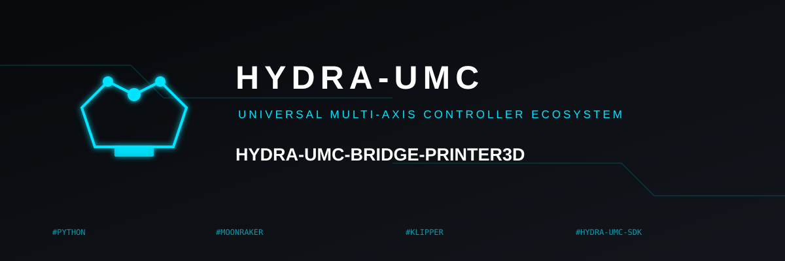
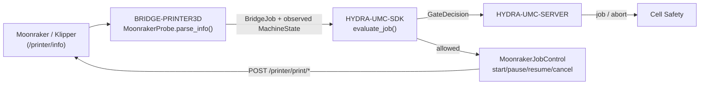

<!-- =============================================================================
HYDRA-UMC-BRIDGE-PRINTER3D - 3D-printer software bridge
Copyright (C) 2026 JuanenRac (Electro Hobby 3D) <electrohobby3d@gmail.com>
GPL-3.0-or-later - see LICENSE
============================================================================= -->

<p align="center">
  
</p>

# 🖨️ HYDRA-UMC-BRIDGE-PRINTER3D

<p align="center">🇺🇸 <b>English</b> | <a href="README_spa.md">🇪🇸 Español</a> | <a href="README_fra.md">🇫🇷 Français</a> | <a href="README_ita.md">🇮🇹 Italiano</a> | <a href="README_deu.md">🇩🇪 Deutsch</a> | <a href="README_zho.md">🇨🇳 简体中文</a> | <a href="README_jpn.md">🇯🇵 日本語</a></p>

### 🌡️ Fail-Safe Coordination Bridge for Open 3D-Printing Software

<p align="left">
  
  
  
</p>

---

## 1. 🛠️ TECHNICAL OVERVIEW

**HYDRA-UMC-BRIDGE-PRINTER3D** is the high-level coordinator for open 3D-printing software (Moonraker/Klipper) and HYDRA-UMC robotic auxiliaries. It also recognizes local slicer artifacts read-only, and can now send real, SDK-gated job commands (start/pause/resume/cancel an already-uploaded, already-sliced file) through Moonraker's own REST API. Native printer firmware remains responsible for motion, heaters, thermal protection and machine interlocks at all times — this bridge never streams raw G-code and never replaces that authority; it only reads readiness, records artifact evidence, sends already-safe job-level commands and coordinates auxiliaries around it.

It belongs to the **External Automation Bridges** family: a set of sibling repositories (CNC, LASER, OPENPNP, PRINTER3D, ROS2) that all speak the same shared safety contract from `HYDRA-UMC-SDK`, so no bridge can invent its own definition of "safe to work".

### Key Features:
* ✅ **Real Moonraker readiness probe:** `moonraker.py`'s `MoonrakerProbe` consumes Moonraker's documented `/printer/info` endpoint with a small stdlib-only client (`urlopen` + `json`) — no extra dependency beyond the Python standard library. *(implemented, tested in `tests/test_moonraker.py`)*
* ✅ **Real fail-closed state parsing:** `parse_info()` maps only the literal `"ready"` to `MachineState.IDLE`; `startup`/`shutdown`/`error` map to `FAULT`, and anything else (including a malformed response) maps to `OFFLINE` — never to a state that would allow a robot to be planned around the printer. *(implemented)*
* ✅ **Real shared safety gate:** every observed job is re-evaluated through `evaluate_job()` from `HYDRA-UMC-SDK`'s `bridge_contract`, the same gate every sibling bridge and HYDRA-UMC-SERVER use. *(implemented)*
* ✅ **Slicer-agnostic artifact inspection:** `artifacts.py` identifies plain FDM G-code from OrcaSlicer, Ultimaker Cura, PrusaSlicer, Bambu Studio and other slicers from local evidence only; it also recognizes 3MF packages and opaque Lychee-compatible resin slices without unpacking, parsing commands, uploading or printing. *(implemented, tested in `tests/test_artifacts.py`)*
* ✅ **Profile-evidence boundary:** `profiles.py` can match an inspected artifact to a declared FDM or resin profile, but returns `execution_authorized=False` even on a match. *(implemented, tested in `tests/test_profiles.py`)*
* ✅ **Real, SDK-gated job commands:** `MoonrakerJobControl` sends real `POST` requests to Moonraker's documented `/printer/print/start|pause|resume|cancel` endpoints — `start_job()` is gated through the same `evaluate_job()` decision every productive dispatch in this ecosystem uses; `pause_job()`/`cancel_job()` are always allowed (same de-escalation reasoning as `ABORT`); `resume_job()` requires a genuinely `HOLDING` printer. It only ever starts an already-uploaded, already-sliced file by name — it never streams raw G-code. *(implemented, tested in `tests/test_moonraker.py`)*
* ✅ **Non-mutating build/test:** `build-test.bat`/`.sh` compile the response parser and safety gate without sending a real command, changing versions or touching a printer. *(implemented, see BUILD & RUN below)*
* 🔜 **Raw G-code streaming** — deliberately still deferred: sending arbitrary low-level commands (not a named, already-sliced job) needs a tested profile, authentication and physical safety review this bridge doesn't have yet. *(planned)*

---

## 2. 🔄 PRINTER COORDINATION FLOW



---

## 3. 🧱 ARCHITECTURE & DESIGN DECISIONS

* **Why only Moonraker's literal `"ready"` state maps to idle.** `parse_info()`'s state mapping is intentionally narrow: `ready` → `IDLE`, `startup`/`shutdown`/`error` → `FAULT` (fail closed), and every other or missing value → `OFFLINE`. There is no default-to-safe assumption for an unrecognized printer state.
* **Why parsing is a separate `@staticmethod` from the network fetch.** `MoonrakerProbe.parse_info()` takes a plain `dict` and is fully unit-testable without a network call or a running printer; `fetch()` is the thin, necessarily-network piece that calls it. The safety-relevant logic lives in the part that never needs a live printer to test.
* **Why the probe uses stdlib `urlopen`/`json` instead of a Moonraker client library.** Keeping the dependency surface to the Python standard library keeps the safety-relevant parsing minimal, auditable and free of a third-party client's own assumptions about retries, timeouts or error handling.
* **Why the bridge builds a new `BridgeJob` and delegates to the shared `evaluate_job()` instead of writing its own accept/reject logic.** All five External Automation Bridges (CNC, LASER, OPENPNP, PRINTER3D, ROS2) reuse the exact same `bridge_contract` from `HYDRA-UMC-SDK`, so "what counts as safe to start a job" cannot silently diverge between them.
* **Why job commands (start/pause/resume/cancel) are real but raw G-code streaming still isn't.** Moonraker's `/printer/print/*` endpoints only ever reference an already-uploaded, already-sliced file by name - the same safety envelope Moonraker/Klipper themselves already enforce on that file. Arbitrary raw G-code is a fundamentally different, much larger trust surface (it can contain anything) and still needs a tested profile, authentication and physical safety review this bridge doesn't have yet.
* **Why `resume_job()` doesn't reuse the generic `evaluate_job()` gate.** That gate is built around "productive work needs an IDLE machine" - backwards for resuming a paused job, which only makes sense from `HOLDING`. Same standalone-gate reasoning already used for DROIDS's `stand_request()`/`sit_request()`.
* **How this fits the rest of the ecosystem.** BRIDGE-PRINTER3D sits between Moonraker/Klipper and `HYDRA-UMC-SDK` → `HYDRA-UMC-SERVER` → cell safety — it coordinates auxiliary robot work around the printer and now sends real, gated job commands, but it never streams raw G-code and never replaces native firmware, heaters or thermal protection.

## 🧾 SLICER ARTIFACT COMPATIBILITY

The read-only artifact lane supports ordinary FDM G-code (`.gcode`, `.gco`, `.gc`) produced by OrcaSlicer, Ultimaker Cura, PrusaSlicer, Bambu Studio and other slicers. Familiar comments supply an origin hint; a missing marker remains `unknown-slicer`. `.gcode.3mf` and generic `.3mf` are fingerprinted but never unpacked. Resin slices (`.ctb`, `.goo`, `.photon`, `.pwmo`, `.pws`, `.sl1`) from Lychee-compatible workflows are deliberately opaque and never attributed to a specific printer or slicer.

This is compatibility with **output artifacts**, not remote control of those applications. The bridge does not start slicers, alter profiles, parse/execute G-code, upload files, contact cloud services or start prints. See [Slicer Artifact Compatibility](docs/SLICER_ARTIFACT_COMPATIBILITY.md) for the precise matrix and future-control prerequisites.

An artifact/profile match is still evidence, never permission to print. [Print Profile Admission Boundary](docs/PRINT_PROFILE_BOUNDARY.md) documents the separate validation required before any future native-controller operation.

---

## 📂 DIRECTORY STRUCTURE

```text
HYDRA-UMC-BRIDGE-PRINTER3D/
├── src/
│   └── hydra_umc_bridge_printer3d/
│       ├── __init__.py
│       ├── artifacts.py         # Read-only G-code, 3MF and resin-slice evidence
│       ├── profiles.py          # Profile compatibility evidence; never print authorization
│       ├── moonraker.py         # MoonrakerProbe + PrinterBridge safety gate
│       └── mqtt_transport.py    # Real MQTT broker transport for this bridge's own already-real Moonraker commands
├── tests/
│   ├── test_artifacts.py         # Slicer artifact evidence tests (no printer I/O)
│   ├── test_profiles.py          # Profile matching always denies execution
│   ├── test_moonraker.py        # Readiness parsing and fail-safe gate tests
│   └── test_mqtt_transport.py   # MQTT command/status shape tests against a fake broker client
├── tools/
│   ├── build_test.py            # Non-mutating compile + test runner (build-test.bat/.sh)
│   ├── inspect_print_artifact.py # Local artifact evidence JSON CLI
│   ├── assess_print_profile.py  # Offline profile-vs-artifact match CLI; never authorizes execution
│   ├── ci_validate.py           # Dependency-free, non-destructive CI baseline (used by .github/workflows/ci.yml)
│   └── bump_version.py          # Synchronizes pyproject.toml, manifest and CHANGELOG.md
├── docs/
│   ├── BRIDGE_GUIDE.md                        # Scope, compatible platforms, scripts, hardware acceptance gate
│   ├── PRINT_PROFILE_BOUNDARY.md              # What profile-compatibility evidence means vs. print authorization
│   └── SLICER_ARTIFACT_COMPATIBILITY.md       # Which slicer artifact formats this bridge can read as evidence
├── images/
│   └── HYDRA_UMC_BANNER.svg     # README banner
├── build-test.bat / build-test.sh  # Validate only, never modifies the repository
├── build.bat / build.sh            # Validate, then bump version + CHANGELOG on success
├── pyproject.toml               # Package metadata; depends on HYDRA-UMC-SDK (git)
├── hydra-umc.project.json       # Ecosystem manifest (version, maturity, family)
├── CHANGELOG.md
├── CODE_OF_CONDUCT.md / CONTRIBUTING.md / SECURITY.md / SUPPORT.md
├── LICENSE / LICENSE.md
└── README.md / README_*.md      # This file and its 6 translations
```

---

## 4. ⚙️ BUILD & RUN

Requires Python 3.11+. `tools/build_test.py` expects `HYDRA-UMC-SDK` checked out as a sibling directory (`../HYDRA-UMC-SDK`) or pointed at via the `HYDRA_UMC_SDK_ROOT` environment variable.

```bash
# Windows
build-test.bat      # validate only — no version/CHANGELOG change
build.bat            # validate, then bump version + CHANGELOG on success

# Linux/macOS
bash build-test.sh
bash build.sh
```

`build-test` compiles every module under `src/` and `tools/` with `py_compile` and runs the full `unittest` suite (`tests/test_moonraker.py` and `tests/test_artifacts.py`), proving readiness-response parsing, artifact inspection and the fail-safe gate — it sends no G-code, touches no printer and never modifies the repository. `build` runs that same validation first and, only on success, calls `tools/bump_version.py` to synchronize the version across `pyproject.toml`, `hydra-umc.project.json` and `CHANGELOG.md`. There is no live printer `run` command yet — that requires a tested profile, authentication and physical safety review.

To inspect a local slicer output without contacting a printer:

```bash
py tools/inspect_print_artifact.py path/to/job.gcode
```

---

## ✅ Current Status & Next Steps

**Real today:** version `0.1.0`, a locally tested Moonraker readiness adapter (`MoonrakerProbe` + `PrinterBridge`) backed by `HYDRA-UMC-SDK`'s shared job gate, real SDK-gated job commands (`MoonrakerJobControl`: start/pause/resume/cancel an already-uploaded file through Moonraker's own REST API), read-only G-code/3MF/resin-slice and profile-compatibility evidence for the major slicer families, a deterministic forty-nine-test `unittest` suite including local HTTP `/printer/info`, the real, separate `/printer/objects/query?print_stats=state` contract, and real `POST` job-command verification, and non-mutating build-test scripts wired into CI with an SDK checkout.

**Integration boundary:** native printer firmware (Klipper via Moonraker) retains motion, heaters, thermal protection and machine interlocks at all times; this bridge reads readiness, sends only already-safe job-level commands (never raw G-code) and gates *auxiliary* robot work around it.

**Still ahead:** the bridge has not been exercised against a real printer, hotend or robot yet (only against a local fixture HTTP server) — raw G-code streaming still requires a tested printer profile, authentication and a physical safety review first.

---

## 🔗 Related Projects

This project is part of the HYDRA-UMC robotics ecosystem by the same author (JuanenRac / Electro Hobby 3D). Worth knowing about, since a request might actually be about one of these rather than this repository.

**Parent Project**
- **[HYDRA-UMC-SERVER](https://github.com/JuanenRac/HYDRA-UMC-SERVER)** — the real headless backend (REST/WebSocket) every control client actually talks to; the authenticated ecosystem boundary this bridge reports to once each command has cleared this bridge's own local safety gate.

**Sibling Projects** — also talk to HYDRA-UMC-SERVER's own API, each their own client
- **[HYDRA-UMC-STUDIO](https://github.com/JuanenRac/HYDRA-UMC-STUDIO)** — web control dashboard with real-time multi-robot 3D visualization.
- **[HYDRA-UMC-SUITE](https://github.com/JuanenRac/HYDRA-UMC-SUITE)** — desktop (PySide6) swarm command center for multiple servers at once, packaged as a standalone executable.
- **[HYDRA-UMC-ANDROID-CONTROL](https://github.com/JuanenRac/HYDRA-UMC-ANDROID-CONTROL)** — native Android control app with biometric login and a paired Wear OS companion.
- **[HYDRA-UMC-IOS-CONTROL](https://github.com/JuanenRac/HYDRA-UMC-IOS-CONTROL)** — iOS/iPadOS control app (Flutter) with real-time WebSocket sync.
- **[HYDRA-UMC-DSI](https://github.com/JuanenRac/HYDRA-UMC-DSI)** — native touch UI for the onboard 7" DSI touchscreen, embedded on the CM5 itself.
- **[HYDRA-UMC-BRIDGE-AMR](https://github.com/JuanenRac/HYDRA-UMC-BRIDGE-AMR)** — coordination boundary for AGV/AMR fleets via a real VDA 5050 MQTT publisher.
- **[HYDRA-UMC-BRIDGE-CNC](https://github.com/JuanenRac/HYDRA-UMC-BRIDGE-CNC)** — high-level CNC-cell coordinator with real GRBL status/control-byte access.
- **[HYDRA-UMC-BRIDGE-DROIDS](https://github.com/JuanenRac/HYDRA-UMC-BRIDGE-DROIDS)** — coordination boundary for legged/humanoid droids, with a real Boston Dynamics Spot command sender.
- **[HYDRA-UMC-BRIDGE-LASER](https://github.com/JuanenRac/HYDRA-UMC-BRIDGE-LASER)** — laser-cell safety coordinator reading 3 real key/enclosure/interlock GPIO safeguards.
- **[HYDRA-UMC-BRIDGE-OPENPNP](https://github.com/JuanenRac/HYDRA-UMC-BRIDGE-OPENPNP)** — safe high-level board-flow coordinator for OpenPnP pick-and-place.
- **[HYDRA-UMC-BRIDGE-ROS2](https://github.com/JuanenRac/HYDRA-UMC-BRIDGE-ROS2)** — safety coordinator with a real, lazily-imported rclpy ROS 2 transport.
- **[HYDRA-UMC-BRIDGE-UAV](https://github.com/JuanenRac/HYDRA-UMC-BRIDGE-UAV)** — coordination boundary for camera-equipped UAVs, with a real MAVLink command sender.

**Directly Related**
- **[HYDRA-UMC-SDK](https://github.com/JuanenRac/HYDRA-UMC-SDK)** — the shared JSON-Schema contract and safety-gate boundary every bridge validates its commands against.
- **[HYDRA-UMC-MQTT-BROKER](https://github.com/JuanenRac/HYDRA-UMC-MQTT-BROKER)** — `mqtt_transport.py`'s real transport for this bridge's own `hydra/bridges/printer3d/...` topics — status plus real Moonraker start/pause/resume/cancel commands, alongside the shared job gate; see that repo's own `docs/BRIDGE_TOPICS.md`.
- **[HYDRA-UMC-SAFETY-ZONES](https://github.com/JuanenRac/HYDRA-UMC-SAFETY-ZONES)** — future workspace safety evidence for this bridge.

**Also Part of the Ecosystem**

*Core Hardware & Platform*
- **[HYDRA-UMC](https://github.com/JuanenRac/HYDRA-UMC)** — the physical robot-arm motherboard: CM5 host + dual-core STM32H745, orchestrating up to 8 tool arms over CAN-OTA/SPI-OTA.
- **[HYDRA-UMC-OS](https://github.com/JuanenRac/HYDRA-UMC-OS)** — reproducible Raspberry Pi OS product layer for the CM5: read-only agent, validated config/profiles, WiFi first-contact provisioning.

*Core Backend & Clients*
- **[HYDRA-UMC-EDITOR-URDF](https://github.com/JuanenRac/HYDRA-UMC-EDITOR-URDF)** — desktop graphical URDF creator/editor that pushes finished models into STUDIO's own catalog.

*URTC Tool Platform*
- **[URTC](https://github.com/JuanenRac/URTC)** — firmware for the physical Universal Robot Tool Controller PCB, 25+ tool profiles over CAN bus.
- **[URTC-FLASHER](https://github.com/JuanenRac/URTC-FLASHER)** — desktop GUI flashing tool for URTC boards, CAN-OTA plus full-chip SWD/JTAG.
- **[URTC-TESTER](https://github.com/JuanenRac/URTC-TESTER)** — desktop live CAN-bus diagnostic tool for URTC boards, one panel per tool profile.
- **[URTC-WEB-STUDIO](https://github.com/JuanenRac/URTC-WEB-STUDIO)** — browser-based alternative to URTC-TESTER via the Web Serial API, no local install needed.

*Vision AI Node (Hailo-8)*
- **[HYDRA-UMC-VISION-NODE](https://github.com/JuanenRac/HYDRA-UMC-VISION-NODE)** — integration hub for the Hailo-8 vision pipeline, with a real per-stage hardware-readiness check.
- **[HYDRA-UMC-DETECTION-HEF](https://github.com/JuanenRac/HYDRA-UMC-DETECTION-HEF)** — real compiled-model registry with Hailo-architecture/checksum safe-load verification.
- **[HYDRA-UMC-VISION-STREAMER](https://github.com/JuanenRac/HYDRA-UMC-VISION-STREAMER)** — real GStreamer pipeline + MediaMTX config generator with a real HailoRT integration boundary.
- **[HYDRA-UMC-VISUAL-SERVOING-API](https://github.com/JuanenRac/HYDRA-UMC-VISUAL-SERVOING-API)** — real Position-Based Visual Servoing correction law, safety-gated on upstream zone state.

*Cognitive AI Node (Hailo-10)*
- **[HYDRA-UMC-COGNITIVE-NODE](https://github.com/JuanenRac/HYDRA-UMC-COGNITIVE-NODE)** — integration hub for the Hailo-10 cognitive pipeline (LLM/VLA/voice orchestration).
- **[HYDRA-UMC-VLA-ENGINE](https://github.com/JuanenRac/HYDRA-UMC-VLA-ENGINE)** — real action-token encoding/decoding and trajectory generation for a Vision-Language-Action model.
- **[HYDRA-UMC-VOICE-UI](https://github.com/JuanenRac/HYDRA-UMC-VOICE-UI)** — real voice front-end (VAD + intent parser) with a bounded, confirmation-gated Watch relay.
- **[HYDRA-UMC-SEMANTIC-PLANNER](https://github.com/JuanenRac/HYDRA-UMC-SEMANTIC-PLANNER)** — real rule-based task decomposition and semantic error recovery over MCU error codes.
- **[HYDRA-UMC-DOCS-QA](https://github.com/JuanenRac/HYDRA-UMC-DOCS-QA)** — real stdlib-only TF-IDF document search over this ecosystem's own Markdown docs.

*Orchestration & Swarm*
- **[HYDRA-UMC-ORCHESTRATOR](https://github.com/JuanenRac/HYDRA-UMC-ORCHESTRATOR)** — integration hub with a real gRPC/Protobuf health-report contract and mission state machine.
- **[HYDRA-UMC-JOB-DISPATCHER](https://github.com/JuanenRac/HYDRA-UMC-JOB-DISPATCHER)** — real priority-based job queue with deduplication, over a real HTTP API.
- **[HYDRA-UMC-NODE-HEALING](https://github.com/JuanenRac/HYDRA-UMC-NODE-HEALING)** — real gRPC-based fleet health watchdog with retry/backoff and identity-mismatch detection.
- **[HYDRA-UMC-PATH-PLANNER-3D](https://github.com/JuanenRac/HYDRA-UMC-PATH-PLANNER-3D)** — real RRT-based 3D path planner with real obstacle/workspace collision validation.
- **[HYDRA-UMC-SWARM-SYNC](https://github.com/JuanenRac/HYDRA-UMC-SWARM-SYNC)** — real CRDT LWW-Element-Map state sync, property-tested for multi-cell convergence.

*Digital Twin & Simulation*
- **[HYDRA-UMC-TWIN](https://github.com/JuanenRac/HYDRA-UMC-TWIN)** — integration hub for the digital-twin engine, with a real version-compatibility sync contract.
- **[HYDRA-UMC-HIL-BRIDGE](https://github.com/JuanenRac/HYDRA-UMC-HIL-BRIDGE)** — real hardware-in-the-loop safety interlock routing commands between simulation and real hardware.
- **[HYDRA-UMC-PHYSICS-REPLICA](https://github.com/JuanenRac/HYDRA-UMC-PHYSICS-REPLICA)** — real forward kinematics and joint-limit validation over a real URDF subset.
- **[HYDRA-UMC-SYNTHETIC-DATA-GEN](https://github.com/JuanenRac/HYDRA-UMC-SYNTHETIC-DATA-GEN)** — real procedural 2D scene generator with YOLO/COCO annotation export.

*Data & Analytics*
- **[HYDRA-UMC-DATALAKE](https://github.com/JuanenRac/HYDRA-UMC-DATALAKE)** — real sqlite3-backed time-series store with a real ingest/query HTTP API.
- **[HYDRA-UMC-ANOMALY-DETECTOR](https://github.com/JuanenRac/HYDRA-UMC-ANOMALY-DETECTOR)** — real FFT + statistical baseline anomaly detector with drift monitoring.
- **[HYDRA-UMC-PRODUCTION-REPORTS](https://github.com/JuanenRac/HYDRA-UMC-PRODUCTION-REPORTS)** — real OEE/availability calculation over DATALAKE history, with reproducible CSV export.
- **[HYDRA-UMC-TELEMETRY-COLLECTOR](https://github.com/JuanenRac/HYDRA-UMC-TELEMETRY-COLLECTOR)** — real CAN/WebSocket ingestion pipeline into DATALAKE, with sequence deduplication.

*Industrial Gateway*
- **[HYDRA-UMC-GATEWAY-INDUSTRIAL](https://github.com/JuanenRac/HYDRA-UMC-GATEWAY-INDUSTRIAL)** — integration hub relaying to industrial protocols, with a real command allowlist/backpressure layer.
- **[HYDRA-UMC-OPCUA-SERVER](https://github.com/JuanenRac/HYDRA-UMC-OPCUA-SERVER)** — real OPC-UA address space, verified with a real binary-protocol client session.
- **[HYDRA-UMC-MTCONNECT-ADAPTER](https://github.com/JuanenRac/HYDRA-UMC-MTCONNECT-ADAPTER)** — real MTConnect `/probe` and `/current` XML endpoints with degraded-mode output.

*Complementary Tools & Ecosystem Operations*
- **[HYDRA-UMC-DASHBOARD-AI](https://github.com/JuanenRac/HYDRA-UMC-DASHBOARD-AI)** — Smart Summaries and Anomaly Highlighting panels over DATALAKE/ANOMALY-DETECTOR, with an honest statistical fallback.
- **[HYDRA-UMC-TOOL-CLI](https://github.com/JuanenRac/HYDRA-UMC-TOOL-CLI)** — fleet CLI with a real, stable exit-code contract, a genuine live client of HYDRA-UMC-SERVER's own API.
- **[HYDRA-UMC-WATCH](https://github.com/JuanenRac/HYDRA-UMC-WATCH)** — WearOS companion app with real haptic alerts and a paired-phone voice relay.
- **[URTC-SMART-RACK](https://github.com/JuanenRac/URTC-SMART-RACK)** — firmware for a board-mounting rack with real tool-ID decoding and Smart Idle pre-heating logic.
- **[URTC-VISION-TOOL](https://github.com/JuanenRac/URTC-VISION-TOOL)** — firmware plus a real Python vision companion for a thermal/RGB inspection tool head.
- **[HYDRA-UMC-UPDATER](https://github.com/JuanenRac/HYDRA-UMC-UPDATER)** — administrative desktop tool that discovers, clones and updates every repo in this ecosystem.
- **[HYDRA-UMC-OS-REBUILDER](https://github.com/JuanenRac/HYDRA-UMC-OS-REBUILDER)** — Windows/Linux desktop tool that builds a ready-to-flash CM5 image pre-loaded with the ecosystem's most current versions, with Raspberry-Pi-Imager-style first-boot Wi-Fi/user/SSH configuration.

---

## 📚 Documentation & Community

- **[CONTRIBUTING.md](CONTRIBUTING.md)** — tech stack and coding guidelines for a pull request.
- **[CODE_OF_CONDUCT.md](CODE_OF_CONDUCT.md)** — the standards of behavior expected in this community.
- **[SECURITY.md](SECURITY.md)** — how to report a vulnerability, and this project's own real security focus areas.
- **[SUPPORT.md](SUPPORT.md)** — where to ask questions and report bugs.
- **[LICENSE.md](LICENSE.md)** — this project's own license.

## 👤 AUTHOR
**JuanenRac** (Electro Hobby 3D)
📧 electrohobby3d@gmail.com
📺 [youtube.com/@electrohobby3d](https://youtube.com/@electrohobby3d)

## 📜 LICENSE
GPL-3.0 - See LICENSE for details.
