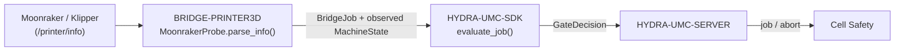

<!-- =============================================================================
HYDRA-UMC-BRIDGE-PRINTER3D - 3D-printer software bridge
Copyright (C) 2026 JuanenRac (Electro Hobby 3D) <electrohobby3d@gmail.com>
GPL-3.0-or-later - see LICENSE
============================================================================= -->

<p align="center">
  
</p>

# 🖨️ HYDRA-UMC-BRIDGE-PRINTER3D

<p align="center">🇺🇸 <b>English</b> | <a href="README_spa.md">🇪🇸 Español</a> | <a href="README_fra.md">🇫🇷 Français</a> | <a href="README_ita.md">🇮🇹 Italiano</a> | <a href="README_deu.md">🇩🇪 Deutsch</a> | <a href="README_zho.md">🇨🇳 简体中文</a> | <a href="README_jpn.md">🇯🇵 日本語</a></p>

### 🌡️ Fail-Safe Coordination Bridge for Open 3D-Printing Software

<p align="left">
  
  
  
</p>

---

## 1. 🛠️ TECHNICAL OVERVIEW

**HYDRA-UMC-BRIDGE-PRINTER3D** is the high-level coordinator for open 3D-printing software (Moonraker/Klipper) and HYDRA-UMC robotic auxiliaries. Native printer firmware remains responsible for motion, heaters, thermal protection and machine interlocks at all times — this bridge only reads readiness and coordinates auxiliaries around it.

It belongs to the **External Automation Bridges** family: a set of sibling repositories (CNC, LASER, OPENPNP, PRINTER3D, ROS2) that all speak the same shared safety contract from `HYDRA-UMC-SDK`, so no bridge can invent its own definition of "safe to work".

### Key Features:
* ✅ **Real Moonraker readiness probe:** `moonraker.py`'s `MoonrakerProbe` consumes Moonraker's documented `/printer/info` endpoint with a small stdlib-only client (`urlopen` + `json`) — no extra dependency beyond the Python standard library. *(implemented, tested in `tests/test_moonraker.py`)*
* ✅ **Real fail-closed state parsing:** `parse_info()` maps only the literal `"ready"` to `MachineState.IDLE`; `startup`/`shutdown`/`error` map to `FAULT`, and anything else (including a malformed response) maps to `OFFLINE` — never to a state that would allow a robot to be planned around the printer. *(implemented)*
* ✅ **Real shared safety gate:** every observed job is re-evaluated through `evaluate_job()` from `HYDRA-UMC-SDK`'s `bridge_contract`, the same gate every sibling bridge and HYDRA-UMC-SERVER use. *(implemented)*
* ✅ **Non-mutating build/test:** `build-test.bat`/`.sh` compile the response parser and safety gate without sending G-code, changing versions or touching a printer. *(implemented, see BUILD & RUN below)*
* 🔜 **Real printer control (G-code commands)** — deferred until a tested profile, authentication and physical safety review are in place. *(planned)*

---

## 2. 🔄 PRINTER COORDINATION FLOW



---

## 3. 🧱 ARCHITECTURE & DESIGN DECISIONS

* **Why only Moonraker's literal `"ready"` state maps to idle.** `parse_info()`'s state mapping is intentionally narrow: `ready` → `IDLE`, `startup`/`shutdown`/`error` → `FAULT` (fail closed), and every other or missing value → `OFFLINE`. There is no default-to-safe assumption for an unrecognized printer state.
* **Why parsing is a separate `@staticmethod` from the network fetch.** `MoonrakerProbe.parse_info()` takes a plain `dict` and is fully unit-testable without a network call or a running printer; `fetch()` is the thin, necessarily-network piece that calls it. The safety-relevant logic lives in the part that never needs a live printer to test.
* **Why the probe uses stdlib `urlopen`/`json` instead of a Moonraker client library.** Keeping the dependency surface to the Python standard library keeps the safety-relevant parsing minimal, auditable and free of a third-party client's own assumptions about retries, timeouts or error handling.
* **Why the bridge builds a new `BridgeJob` and delegates to the shared `evaluate_job()` instead of writing its own accept/reject logic.** All five External Automation Bridges (CNC, LASER, OPENPNP, PRINTER3D, ROS2) reuse the exact same `bridge_contract` from `HYDRA-UMC-SDK`, so "what counts as safe to start a job" cannot silently diverge between them.
* **Why real commands (G-code) require a tested profile, authentication and physical safety review first.** Moonraker's API can accept arbitrary G-code; sending it without a validated profile and auth would bypass the very readiness check this bridge exists to enforce.
* **How this fits the rest of the ecosystem.** BRIDGE-PRINTER3D sits between Moonraker/Klipper and `HYDRA-UMC-SDK` → `HYDRA-UMC-SERVER` → cell safety — it coordinates auxiliary robot work around the printer, it never replaces native firmware, heaters or thermal protection.

---

## 📂 DIRECTORY STRUCTURE

```text
HYDRA-UMC-BRIDGE-PRINTER3D/
├── src/
│   └── hydra_umc_bridge_printer3d/
│       ├── __init__.py
│       └── moonraker.py         # MoonrakerProbe + PrinterBridge safety gate
├── tests/
│   └── test_moonraker.py        # Readiness parsing and fail-safe gate tests
├── tools/
│   ├── build_test.py            # Non-mutating compile + test runner (build-test.bat/.sh)
│   └── bump_version.py          # Synchronizes pyproject.toml, manifest and CHANGELOG.md
├── build-test.bat / build-test.sh  # Validate only, never modifies the repository
├── build.bat / build.sh            # Validate, then bump version + CHANGELOG on success
├── pyproject.toml               # Package metadata; depends on HYDRA-UMC-SDK (git)
├── hydra-umc.project.json       # Ecosystem manifest (version, maturity, family)
├── CHANGELOG.md
├── CODE_OF_CONDUCT.md / CONTRIBUTING.md / SECURITY.md / SUPPORT.md
├── LICENSE / LICENSE.md
└── README.md / README_*.md      # This file and its 6 translations
```

---

## 4. ⚙️ BUILD & RUN

Requires Python 3.11+. `tools/build_test.py` expects `HYDRA-UMC-SDK` checked out as a sibling directory (`../HYDRA-UMC-SDK`) or pointed at via the `HYDRA_UMC_SDK_ROOT` environment variable.

```bash
# Windows
build-test.bat      # validate only — no version/CHANGELOG change
build.bat            # validate, then bump version + CHANGELOG on success

# Linux/macOS
bash build-test.sh
bash build.sh
```

`build-test` compiles every module under `src/` with `py_compile` and runs the full `unittest` suite (`tests/test_moonraker.py`), proving readiness-response parsing and the fail-safe gate — it sends no G-code, touches no printer and never modifies the repository. `build` runs that same validation first and, only on success, calls `tools/bump_version.py` to synchronize the version across `pyproject.toml`, `hydra-umc.project.json` and `CHANGELOG.md`. There is no live printer `run` command yet — that requires a tested profile, authentication and physical safety review.

---

## ✅ Current Status & Next Steps

**Real today:** version `0.0.1`, a locally tested Moonraker readiness adapter (`MoonrakerProbe` + `PrinterBridge`) backed by `HYDRA-UMC-SDK`'s shared job gate, a deterministic `unittest` suite, and non-mutating build-test scripts wired into CI with an SDK checkout.

**Integration boundary:** native printer firmware (Klipper via Moonraker) retains motion, heaters, thermal protection and machine interlocks at all times; this bridge only ever reads readiness and gates *auxiliary* robot work around it.

**Still ahead:** the bridge has not controlled a real printer, hotend or robot — sending real commands requires a tested printer profile, authentication and a physical safety review first.

---

## 🔗 Related Projects

This project is part of a larger robotics ecosystem by the same author (JuanenRac / Electro Hobby 3D), spanning firmware, control software, AI nodes and fleet tooling. Worth knowing about, since a request might actually be about one of these rather than this repository.

### Directly Related

- **[HYDRA-UMC-SDK](https://github.com/JuanenRac/HYDRA-UMC-SDK)** — the shared `bridge_contract` job gate every bridge (including this one) evaluates jobs through.
- **[HYDRA-UMC-SERVER](https://github.com/JuanenRac/HYDRA-UMC-SERVER)** — the authorised coordination endpoint this bridge reports to.
- **[HYDRA-UMC-SAFETY-ZONES](https://github.com/JuanenRac/HYDRA-UMC-SAFETY-ZONES)** — future workspace safety evidence.

### Rest of the Ecosystem

**HYDRA-UMC platform** — the multi-robot micro-factory cell this bridge coordinates auxiliaries for
- **[HYDRA-UMC](https://github.com/JuanenRac/HYDRA-UMC)** — the CM5 + STM32H745 motherboard orchestrating up to 8 robot arms.
- **[HYDRA-UMC-SERVER](https://github.com/JuanenRac/HYDRA-UMC-SERVER)** — the Express/WebSocket backend every control client and bridge talks to.
- **[HYDRA-UMC-STUDIO](https://github.com/JuanenRac/HYDRA-UMC-STUDIO)** — web-based control dashboard, multi-robot 3D visualization.

**External Automation Bridges** — sibling repos sharing this same `HYDRA-UMC-SDK` job gate
- **[HYDRA-UMC-BRIDGE-CNC](https://github.com/JuanenRac/HYDRA-UMC-BRIDGE-CNC)** — CNC cell coordination bridge.
- **[HYDRA-UMC-BRIDGE-LASER](https://github.com/JuanenRac/HYDRA-UMC-BRIDGE-LASER)** — laser-cell coordination bridge.
- **[HYDRA-UMC-BRIDGE-OPENPNP](https://github.com/JuanenRac/HYDRA-UMC-BRIDGE-OPENPNP)** — board-flow bridge for OpenPnP.
- **[HYDRA-UMC-BRIDGE-ROS2](https://github.com/JuanenRac/HYDRA-UMC-BRIDGE-ROS2)** — bidirectional coordination boundary with ROS 2.

**Safety & Integration Evidence**
- **[HYDRA-UMC-SAFETY-ZONES](https://github.com/JuanenRac/HYDRA-UMC-SAFETY-ZONES)** — cell-zone safety evidence used across the bridge family.
- **[HYDRA-UMC-HIL-BRIDGE](https://github.com/JuanenRac/HYDRA-UMC-HIL-BRIDGE)** — hardware-in-the-loop test evidence.

## 👤 AUTHOR
**JuanenRac** (Electro Hobby 3D)
📧 electrohobby3d@gmail.com

## 📜 LICENSE
GPL-3.0 - See LICENSE for details.

## 🛠️ BUILD & RUN

Use the non-versioning build check before a release build:

| Action | Windows | Linux / macOS |
|---|---|---|
| Build check (no version or CHANGELOG change) | `build-test.bat` | `./build-test.sh` |
| Run / development (when provided) | `run*.bat` or `dev*.bat` | `./run*.sh` or `./dev*.sh` |

`build-test.bat` and `build-test.sh` compile or validate the project stack without incrementing `hydra-umc.project.json` or modifying `CHANGELOG.md`. They may create normal compiler output only. Existing `build*.bat`, `build*.sh`, `run*` and `dev*` scripts retain their project-specific, versioned or runtime behavior; use them when that behavior is required.
