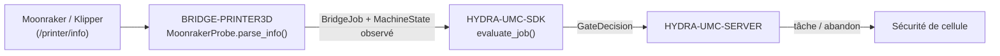

<!-- =============================================================================
HYDRA-UMC-BRIDGE-PRINTER3D - Pont logiciel pour impression 3D
Copyright (C) 2026 JuanenRac (Electro Hobby 3D) <electrohobby3d@gmail.com>
GPL-3.0-or-later - see LICENSE
============================================================================= -->

<p align="center">
  
</p>

# 🖨️ HYDRA-UMC-BRIDGE-PRINTER3D

<p align="center"><a href="README.md">🇺🇸 English</a> | <a href="README_spa.md">🇪🇸 Español</a> | 🇫🇷 <b>Français</b> | <a href="README_ita.md">🇮🇹 Italiano</a> | <a href="README_deu.md">🇩🇪 Deutsch</a> | <a href="README_zho.md">🇨🇳 简体中文</a> | <a href="README_jpn.md">🇯🇵 日本語</a></p>

### 🌡️ Pont de coordination à sécurité intrinsèque pour logiciels d'impression 3D ouverts

<p align="left">
  
  
  
</p>

---

## 1. 🛠️ APERÇU TECHNIQUE

**HYDRA-UMC-BRIDGE-PRINTER3D** est le coordinateur haut niveau pour les logiciels d'impression 3D ouverts (Moonraker/Klipper) et les auxiliaires robotiques HYDRA-UMC. Il reconnaît aussi les artefacts locaux de slicer en lecture seule. Le firmware natif de l'imprimante reste responsable en permanence du mouvement, des chauffages, de la protection thermique et des interverrouillages machine — ce pont lit seulement la disponibilité, enregistre l'évidence de l'artefact et coordonne des auxiliaires autour de cela.

Il appartient à la famille **External Automation Bridges** : un ensemble de dépôts frères (CNC, LASER, OPENPNP, PRINTER3D, ROS2) qui partagent le même contrat de sécurité de `HYDRA-UMC-SDK`, afin qu'aucun pont ne puisse inventer sa propre définition du « sûr pour travailler ».

### Fonctionnalités clés :
* ✅ **Sonde de disponibilité Moonraker, réelle :** `moonraker.py` — `MoonrakerProbe` consomme le point de terminaison documenté `/printer/info` de Moonraker avec un petit client basé uniquement sur la bibliothèque standard (`urlopen` + `json`) — aucune dépendance supplémentaire au-delà de la bibliothèque standard Python. *(implémenté, testé dans `tests/test_moonraker.py`)*
* ✅ **Analyse d'état à sécurité intrinsèque, réelle :** `parse_info()` ne mappe que la chaîne littérale `"ready"` vers `MachineState.IDLE` ; `startup`/`shutdown`/`error` sont mappés vers `FAULT`, et tout le reste (y compris une réponse malformée) vers `OFFLINE` — jamais vers un état qui permettrait de planifier un robot autour de l'imprimante. *(implémenté)*
* ✅ **Portail de sécurité partagé, réel :** chaque tâche observée est réévaluée via `evaluate_job()` du `bridge_contract` de `HYDRA-UMC-SDK`, le même portail utilisé par tous les ponts frères et HYDRA-UMC-SERVER. *(implémenté)*
* ✅ **Inspection d'artefacts indépendante du slicer :** `artifacts.py` identifie le G-code FDM simple d'OrcaSlicer, Ultimaker Cura, PrusaSlicer, Bambu Studio et d'autres slicers uniquement par preuve locale ; il reconnaît aussi les paquets 3MF et les slices de résine compatibles Lychee sans dépaqueter, analyser des commandes, téléverser ni imprimer. *(implémenté, testé dans `tests/test_artifacts.py`)*
* ✅ **Frontière de preuve de profil :** `profiles.py` peut faire correspondre un artefact inspecté à un profil FDM ou résine déclaré, mais renvoie `execution_authorized=False` même en cas de correspondance. *(implémenté, testé dans `tests/test_profiles.py`)*
* ✅ **Commandes de tâche réelles, contrôlées par le SDK :** `MoonrakerJobControl` envoie de véritables requêtes `POST` aux endpoints documentés `/printer/print/start|pause|resume|cancel` de Moonraker — `start_job()` est conditionné à la même décision `evaluate_job()` que toute répartition productive de cet écosystème ; `pause_job()`/`cancel_job()` sont toujours autorisés (même raisonnement de désescalade que `ABORT`) ; `resume_job()` nécessite une imprimante véritablement en `HOLDING`. Il ne démarre jamais qu'un fichier déjà téléversé et déjà tranché, par son nom — il ne diffuse jamais de G-code brut. *(implémenté, testé dans `tests/test_moonraker.py`)*
* ✅ **Build/test non mutant :** `build-test.bat`/`.sh` compilent l'analyseur de réponse et le portail de sécurité sans envoyer de G-code, changer de version ni toucher une imprimante. *(implémenté, voir COMPILATION & EXÉCUTION ci-dessous)*
* 🔜 **Streaming de G-code brut** — délibérément encore reporté : envoyer des commandes arbitraires de bas niveau (pas une tâche nommée déjà tranchée) nécessite un profil testé, une authentification et une revue de sécurité physique que ce pont n'a pas encore. *(prévu)*

---

## 2. 🔄 FLUX DE COORDINATION DE L'IMPRIMANTE



---

## 3. 🧱 ARCHITECTURE ET CHOIX DE CONCEPTION

* **Pourquoi seul l'état littéral `"ready"` de Moonraker est mappé vers le repos.** Le mappage d'état de `parse_info()` est délibérément étroit : `ready` → `IDLE`, `startup`/`shutdown`/`error` → `FAULT` (sécurité intrinsèque), et toute autre valeur ou valeur absente → `OFFLINE`. Il n'y a aucune hypothèse « par défaut sûr » pour un état d'imprimante non reconnu.
* **Pourquoi l'analyse est une `@staticmethod` séparée de la récupération réseau.** `MoonrakerProbe.parse_info()` prend un simple `dict` et est entièrement testable unitairement sans appel réseau ni imprimante en fonctionnement ; `fetch()` est la pièce mince et nécessairement réseau qui l'appelle. La logique liée à la sécurité vit dans la partie qui n'a jamais besoin d'une imprimante réelle pour être testée.
* **Pourquoi la sonde utilise `urlopen`/`json` de la bibliothèque standard plutôt qu'une bibliothèque cliente Moonraker.** Limiter la surface de dépendance à la bibliothèque standard Python garde l'analyse liée à la sécurité minimale, auditable et exempte des propres hypothèses d'un client tiers sur les tentatives, délais ou gestion d'erreurs.
* **Pourquoi le pont construit un nouveau `BridgeJob` et délègue au `evaluate_job()` partagé plutôt que d'écrire sa propre logique d'acceptation/rejet.** Les cinq External Automation Bridges (CNC, LASER, OPENPNP, PRINTER3D, ROS2) réutilisent exactement le même `bridge_contract` de `HYDRA-UMC-SDK`, afin que « ce qui compte comme sûr pour démarrer une tâche » ne puisse pas diverger silencieusement entre eux.
* **Pourquoi les commandes de tâche (start/pause/resume/cancel) sont réelles mais le streaming de G-code brut ne l'est pas encore.** Les endpoints `/printer/print/*` de Moonraker ne font jamais référence qu'à un fichier déjà téléversé et déjà tranché, par son nom - la même enveloppe de sécurité que Moonraker/Klipper appliquent déjà eux-mêmes sur ce fichier. Le G-code brut arbitraire est une surface de confiance fondamentalement différente et bien plus large (il peut contenir n'importe quoi) et nécessite encore un profil testé, une authentification et une revue de sécurité physique que ce pont n'a pas encore.
* **Pourquoi `resume_job()` ne réutilise pas le portail générique `evaluate_job()`.** Ce portail est construit autour de « le travail productif nécessite une machine IDLE » - l'inverse de la reprise d'une tâche en pause, qui n'a de sens qu'à partir de `HOLDING`. Même raisonnement de portail autonome déjà utilisé pour `stand_request()`/`sit_request()` de DROIDS.
* **Comment cela s'intègre dans le reste de l'écosystème.** BRIDGE-PRINTER3D se situe entre Moonraker/Klipper et `HYDRA-UMC-SDK` → `HYDRA-UMC-SERVER` → sécurité de cellule : il coordonne le travail robotique auxiliaire autour de l'imprimante, il ne remplace jamais le firmware natif, les chauffages ni la protection thermique.

## 🧾 COMPATIBILITÉ DES ARTEFACTS DE SLICER

La voie d'artefact en lecture seule accepte le G-code FDM normal (`.gcode`, `.gco`, `.gc`) produit par OrcaSlicer, Ultimaker Cura, PrusaSlicer, Bambu Studio et d'autres slicers. Les commentaires familiers fournissent un indice d'origine ; sans marqueur, la valeur reste `unknown-slicer`. Les `.gcode.3mf` et `.3mf` génériques sont identifiés, mais jamais dépaquetés. Les slices de résine (`.ctb`, `.goo`, `.photon`, `.pwmo`, `.pws`, `.sl1`) de flux compatibles Lychee sont délibérément opaques et ne sont jamais attribués à une imprimante ou un slicer précis.

Il s'agit de compatibilité avec les **artefacts de sortie**, pas du contrôle distant de ces applications. Le pont ne lance pas de slicer, ne modifie pas de profil, n'analyse/n'exécute pas le G-code, ne téléverse pas de fichier, ne contacte pas de service cloud et ne démarre pas d'impression. Consultez [Compatibilité des artefacts de slicer](docs/SLICER_ARTIFACT_COMPATIBILITY.md) pour la matrice précise et les prérequis d'un contrôle futur.

---

## 📂 STRUCTURE DES RÉPERTOIRES

```text
HYDRA-UMC-BRIDGE-PRINTER3D/
├── src/
│   └── hydra_umc_bridge_printer3d/
│       ├── __init__.py
│       ├── artifacts.py         # Preuve en lecture seule G-code, 3MF et slice de résine
│       ├── profiles.py          # Preuve de compatibilité de profil ; jamais une autorisation d'impression
│       ├── moonraker.py         # Portail de sécurité MoonrakerProbe + PrinterBridge
│       └── mqtt_transport.py    # Transport MQTT réel pour la logique Moonraker déjà réelle de ce bridge
├── tests/
│   ├── test_artifacts.py         # Tests d'évidence slicer (sans E/S imprimante)
│   ├── test_profiles.py         # La correspondance de profil refuse toujours l'exécution
│   ├── test_moonraker.py        # Tests d'analyse de disponibilité et de portail de sécurité
│   └── test_mqtt_transport.py   # Tests de forme commande/état MQTT contre un client broker simulé
├── tools/
│   ├── build_test.py            # Compilateur + lanceur de tests non mutant (build-test.bat/.sh)
│   ├── inspect_print_artifact.py # CLI JSON d'évidence locale de l'artefact
│   └── bump_version.py          # Synchronise pyproject.toml, manifeste et CHANGELOG.md
├── docs/
│   ├── BRIDGE_GUIDE.md                        # Portée, plateformes compatibles, scripts, portail d'acceptation matérielle
│   ├── PRINT_PROFILE_BOUNDARY.md              # Ce que signifie la preuve de compatibilité de profil face à l'autorisation d'impression
│   └── SLICER_ARTIFACT_COMPATIBILITY.md       # Quels formats d'artefact slicer ce bridge peut lire comme preuve
├── images/
│   └── HYDRA_UMC_BANNER.svg     # Bannière du README
├── build-test.bat / build-test.sh  # Valide uniquement, ne modifie jamais le dépôt
├── build.bat / build.sh            # Valide puis, si succès, incrémente version + CHANGELOG
├── pyproject.toml               # Métadonnées du paquet ; dépend de HYDRA-UMC-SDK (git)
├── hydra-umc.project.json       # Manifeste de l'écosystème (version, maturité, famille)
├── CHANGELOG.md
├── CODE_OF_CONDUCT.md / CONTRIBUTING.md / SECURITY.md / SUPPORT.md
├── LICENSE / LICENSE.md
└── README.md / README_*.md      # Ce fichier et ses 6 traductions
```

---

## 4. ⚙️ COMPILATION ET EXÉCUTION

Nécessite Python 3.11+. `tools/build_test.py` attend que `HYDRA-UMC-SDK` soit cloné en tant que répertoire frère (`../HYDRA-UMC-SDK`) ou indiqué via la variable d'environnement `HYDRA_UMC_SDK_ROOT`.

```bash
# Windows
build-test.bat      # validation uniquement — pas de changement de version/CHANGELOG
build.bat            # valide puis, si succès, incrémente version + CHANGELOG

# Linux/macOS
bash build-test.sh
bash build.sh
```

`build-test` compile chaque module de `src/` et `tools/` avec `py_compile` et exécute toute la suite `unittest` (`tests/test_moonraker.py` et `tests/test_artifacts.py`), démontrant l'analyse de disponibilité, l'inspection d'artefacts et le portail de sécurité — il n'envoie aucun G-code, ne touche aucune imprimante et ne modifie jamais le dépôt. `build` exécute d'abord cette même validation et, seulement en cas de succès, appelle `tools/bump_version.py` pour synchroniser la version dans `pyproject.toml`, `hydra-umc.project.json` et `CHANGELOG.md`. Il n'existe pas encore de commande `run` imprimante réelle — cela nécessite d'abord un profil testé, une authentification et une revue de sécurité physique.

Pour inspecter une sortie locale de slicer sans contacter une imprimante :

```bash
py tools/inspect_print_artifact.py chemin/vers/travail.gcode
```

---

## ✅ ÉTAT ACTUEL ET PROCHAINES ÉTAPES

**Réel aujourd'hui :** version `0.1.0`, un adaptateur de disponibilité Moonraker testé localement (`MoonrakerProbe` + `PrinterBridge`) adossé au portail de tâches partagé de `HYDRA-UMC-SDK`, de véritables commandes de tâche contrôlées par le SDK (`MoonrakerJobControl` : démarrer/mettre en pause/reprendre/annuler un fichier déjà téléversé via l'API REST propre de Moonraker), une preuve en lecture seule d'artefacts G-code/3MF/slices de résine et de compatibilité de profil pour les principales familles de trancheurs, une suite `unittest` déterministe de quarante-neuf tests incluant la vérification du contrat HTTP local `/printer/info`, le contrat réel et séparé `/printer/objects/query?print_stats=state`, et la vérification réelle des commandes de tâche `POST`, et des scripts build-test non mutants intégrés en CI avec clonage du SDK.

**Frontière d'intégration :** le firmware natif de l'imprimante (Klipper via Moonraker) conserve à tout moment le mouvement, les chauffages, la protection thermique et les interverrouillages machine ; ce pont ne fait que lire la disponibilité et réguler le travail robotique *auxiliaire* autour de cela.

**Encore à venir :** le pont n'a piloté ni imprimante, ni hotend, ni robot réels — envoyer des commandes réelles nécessite d'abord un profil d'imprimante testé, une authentification et une revue de sécurité physique.

---

## 🔗 PROJETS LIÉS

Ce projet fait partie d'un écosystème robotique plus large du même auteur (JuanenRac / Electro Hobby 3D), couvrant firmware, logiciel de contrôle, nœuds d'IA et outillage de flotte. Cela vaut la peine de le savoir, car une demande pourrait en réalité concerner l'un de ces projets plutôt que ce dépôt.

### Directement liés

- **[HYDRA-UMC-SDK](https://github.com/JuanenRac/HYDRA-UMC-SDK)** — le portail de tâches partagé `bridge_contract` à travers lequel ce pont (et tous les autres) évalue ses tâches.
- **[HYDRA-UMC-SERVER](https://github.com/JuanenRac/HYDRA-UMC-SERVER)** — le point de coordination autorisé auquel ce pont rend compte.
- **[HYDRA-UMC-MQTT-BROKER](https://github.com/JuanenRac/HYDRA-UMC-MQTT-BROKER)** — le transport réel de `mqtt_transport.py` pour les topics `hydra/bridges/printer3d/...` propres à ce pont (état, start/pause/resume/cancel Moonraker réel, le portail de travail partagé) - voir le `docs/BRIDGE_TOPICS.md` de ce dépôt.
- **[HYDRA-UMC-SAFETY-ZONES](https://github.com/JuanenRac/HYDRA-UMC-SAFETY-ZONES)** — future preuve de sécurité de l'espace de travail.

### Reste de l'écosystème

**Plateforme HYDRA-UMC** — la micro-usine multi-robot pour laquelle ce pont coordonne les auxiliaires
- **[HYDRA-UMC](https://github.com/JuanenRac/HYDRA-UMC)** — la carte mère CM5 + STM32H745 orchestrant jusqu'à 8 bras robotiques.
- **[HYDRA-UMC-SERVER](https://github.com/JuanenRac/HYDRA-UMC-SERVER)** — le backend Express/WebSocket auquel parlent tous les clients de contrôle et ponts.
- **[HYDRA-UMC-STUDIO](https://github.com/JuanenRac/HYDRA-UMC-STUDIO)** — tableau de bord web, visualisation 3D multi-robot.

**External Automation Bridges** — dépôts frères partageant ce même portail de tâches `HYDRA-UMC-SDK`
- **[HYDRA-UMC-BRIDGE-CNC](https://github.com/JuanenRac/HYDRA-UMC-BRIDGE-CNC)** — pont de coordination de cellule CNC.
- **[HYDRA-UMC-BRIDGE-LASER](https://github.com/JuanenRac/HYDRA-UMC-BRIDGE-LASER)** — pont de coordination de cellules laser.
- **[HYDRA-UMC-BRIDGE-OPENPNP](https://github.com/JuanenRac/HYDRA-UMC-BRIDGE-OPENPNP)** — pont de flux de cartes pour OpenPnP.
- **[HYDRA-UMC-BRIDGE-ROS2](https://github.com/JuanenRac/HYDRA-UMC-BRIDGE-ROS2)** — frontière de coordination bidirectionnelle avec ROS 2.

**Preuves de sécurité et d'intégration**
- **[HYDRA-UMC-SAFETY-ZONES](https://github.com/JuanenRac/HYDRA-UMC-SAFETY-ZONES)** — preuves de sécurité des zones de cellule utilisées dans toute la famille de ponts.
- **[HYDRA-UMC-HIL-BRIDGE](https://github.com/JuanenRac/HYDRA-UMC-HIL-BRIDGE)** — preuves de tests hardware-in-the-loop.

## 👤 AUTEUR
**JuanenRac** (Electro Hobby 3D)
📧 electrohobby3d@gmail.com
📺 [youtube.com/@electrohobby3d](https://youtube.com/@electrohobby3d)

## 📜 LICENCE
GPL-3.0 - Voir LICENSE pour les détails.
