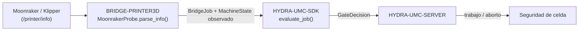

<!-- =============================================================================
HYDRA-UMC-BRIDGE-PRINTER3D - Puente de software para impresión 3D
Copyright (C) 2026 JuanenRac (Electro Hobby 3D) <electrohobby3d@gmail.com>
GPL-3.0-or-later - see LICENSE
============================================================================= -->

<p align="center">
  
</p>

# 🖨️ HYDRA-UMC-BRIDGE-PRINTER3D

<p align="center"><a href="README.md">🇺🇸 English</a> | 🇪🇸 <b>Español</b> | <a href="README_fra.md">🇫🇷 Français</a> | <a href="README_ita.md">🇮🇹 Italiano</a> | <a href="README_deu.md">🇩🇪 Deutsch</a> | <a href="README_zho.md">🇨🇳 简体中文</a> | <a href="README_jpn.md">🇯🇵 日本語</a></p>

### 🌡️ Puente de coordinación seguro por defecto para software abierto de impresión 3D

<p align="left">
  
  
  
</p>

---

## 1. 🛠️ VISIÓN TÉCNICA GENERAL

**HYDRA-UMC-BRIDGE-PRINTER3D** es el coordinador de alto nivel para software abierto de impresión 3D (Moonraker/Klipper) y auxiliares robóticos HYDRA-UMC. El firmware nativo de la impresora sigue siendo responsable en todo momento del movimiento, los calefactores, la protección térmica y los enclavamientos de máquina; este puente solo lee la disponibilidad y coordina auxiliares a su alrededor.

Pertenece a la familia **External Automation Bridges**: un conjunto de repositorios hermanos (CNC, LASER, OPENPNP, PRINTER3D, ROS2) que hablan el mismo contrato de seguridad compartido de `HYDRA-UMC-SDK`, de modo que ningún puente puede inventar su propia definición de "seguro para trabajar".

### Características clave:
* ✅ **Sonda de disponibilidad Moonraker, real:** `moonraker.py` — `MoonrakerProbe` consume el endpoint documentado `/printer/info` de Moonraker con un pequeño cliente basado únicamente en la biblioteca estándar (`urlopen` + `json`), sin dependencias adicionales más allá de la biblioteca estándar de Python. *(implementado, probado en `tests/test_moonraker.py`)*
* ✅ **Análisis de estado seguro por defecto, real:** `parse_info()` solo mapea la cadena literal `"ready"` a `MachineState.IDLE`; `startup`/`shutdown`/`error` se mapean a `FAULT`, y cualquier otra cosa (incluida una respuesta malformada) se mapea a `OFFLINE` — nunca a un estado que permitiría planificar un robot alrededor de la impresora. *(implementado)*
* ✅ **Puerta de seguridad compartida, real:** cada trabajo observado se reevalúa mediante `evaluate_job()` de `bridge_contract` en `HYDRA-UMC-SDK`, la misma puerta que usan todos los puentes hermanos y HYDRA-UMC-SERVER. *(implementado)*
* ✅ **Compilación/prueba no mutante:** `build-test.bat`/`.sh` compilan el analizador de respuestas y la puerta de seguridad sin enviar G-code, cambiar versiones ni tocar una impresora. *(implementado, ver COMPILACIÓN Y EJECUCIÓN más abajo)*
* 🔜 **Control real de impresora (comandos G-code)** — aplazado hasta disponer de un perfil probado, autenticación y revisión de seguridad física. *(planeado)*

---

## 2. 🔄 FLUJO DE COORDINACIÓN DE IMPRESORA



---

## 3. 🧱 ARQUITECTURA Y DECISIONES DE DISEÑO

* **Por qué solo el estado literal `"ready"` de Moonraker se mapea a reposo.** El mapeo de estado de `parse_info()` es deliberadamente estrecho: `ready` → `IDLE`, `startup`/`shutdown`/`error` → `FAULT` (seguro por defecto), y cualquier otro valor o valor ausente → `OFFLINE`. No existe una suposición de "seguro por defecto" para un estado de impresora no reconocido.
* **Por qué el análisis es un `@staticmethod` separado de la obtención por red.** `MoonrakerProbe.parse_info()` recibe un `dict` sencillo y es totalmente comprobable mediante pruebas unitarias sin necesidad de una llamada de red ni una impresora en marcha; `fetch()` es la pieza delgada y necesariamente de red que lo llama. La lógica relevante para la seguridad reside en la parte que nunca necesita una impresora real para probarse.
* **Por qué la sonda usa `urlopen`/`json` de la biblioteca estándar en lugar de una librería cliente de Moonraker.** Mantener la superficie de dependencias limitada a la biblioteca estándar de Python mantiene el análisis relevante para la seguridad mínimo, auditable y libre de las propias suposiciones de un cliente de terceros sobre reintentos, tiempos de espera o manejo de errores.
* **Por qué el puente construye un nuevo `BridgeJob` y delega en el `evaluate_job()` compartido en lugar de escribir su propia lógica de aceptación/rechazo.** Los cinco External Automation Bridges (CNC, LASER, OPENPNP, PRINTER3D, ROS2) reutilizan exactamente el mismo `bridge_contract` de `HYDRA-UMC-SDK`, de modo que "qué cuenta como seguro para iniciar un trabajo" no puede divergir silenciosamente entre ellos.
* **Por qué los comandos reales (G-code) requieren antes un perfil probado, autenticación y revisión de seguridad física.** La API de Moonraker puede aceptar G-code arbitrario; enviarlo sin un perfil validado y autenticación eludiría precisamente la comprobación de disponibilidad que este puente existe para hacer cumplir.
* **Cómo encaja en el resto del ecosistema.** BRIDGE-PRINTER3D se sitúa entre Moonraker/Klipper y `HYDRA-UMC-SDK` → `HYDRA-UMC-SERVER` → seguridad de celda: coordina trabajo robótico auxiliar alrededor de la impresora, nunca reemplaza el firmware nativo, los calefactores ni la protección térmica.

---

## 📂 ESTRUCTURA DE DIRECTORIOS

```text
HYDRA-UMC-BRIDGE-PRINTER3D/
├── src/
│   └── hydra_umc_bridge_printer3d/
│       ├── __init__.py
│       └── moonraker.py         # Puerta de seguridad MoonrakerProbe + PrinterBridge
├── tests/
│   └── test_moonraker.py        # Pruebas de análisis de disponibilidad y puerta de seguridad
├── tools/
│   ├── build_test.py            # Compilador + ejecutor de pruebas no mutante (build-test.bat/.sh)
│   └── bump_version.py          # Sincroniza pyproject.toml, manifiesto y CHANGELOG.md
├── build-test.bat / build-test.sh  # Solo valida, nunca modifica el repositorio
├── build.bat / build.sh            # Valida y, solo si tiene éxito, sube versión + CHANGELOG
├── pyproject.toml               # Metadatos del paquete; depende de HYDRA-UMC-SDK (git)
├── hydra-umc.project.json       # Manifiesto del ecosistema (versión, madurez, familia)
├── CHANGELOG.md
├── CODE_OF_CONDUCT.md / CONTRIBUTING.md / SECURITY.md / SUPPORT.md
├── LICENSE / LICENSE.md
└── README.md / README_*.md      # Este archivo y sus 6 traducciones
```

---

## 4. ⚙️ COMPILACIÓN Y EJECUCIÓN

Requiere Python 3.11+. `tools/build_test.py` espera que `HYDRA-UMC-SDK` esté clonado como directorio hermano (`../HYDRA-UMC-SDK`) o indicado mediante la variable de entorno `HYDRA_UMC_SDK_ROOT`.

```bash
# Windows
build-test.bat      # solo valida — sin cambio de versión/CHANGELOG
build.bat            # valida y, si tiene éxito, sube versión + CHANGELOG

# Linux/macOS
bash build-test.sh
bash build.sh
```

`build-test` compila cada módulo bajo `src/` con `py_compile` y ejecuta la batería completa de `unittest` (`tests/test_moonraker.py`), demostrando el análisis de la respuesta de disponibilidad y la puerta de seguridad — no envía G-code, no toca una impresora y nunca modifica el repositorio. `build` ejecuta primero esa misma validación y, solo si tiene éxito, llama a `tools/bump_version.py` para sincronizar la versión en `pyproject.toml`, `hydra-umc.project.json` y `CHANGELOG.md`. Todavía no existe un comando `run` real de impresora — eso requiere un perfil probado, autenticación y revisión de seguridad física.

---

## ✅ ESTADO ACTUAL Y PRÓXIMOS PASOS

**Real hoy:** versión `0.0.1`, un adaptador de disponibilidad Moonraker probado en local (`MoonrakerProbe` + `PrinterBridge`) apoyado en la puerta de trabajo compartida de `HYDRA-UMC-SDK`, una batería `unittest` determinista, y scripts de build-test no mutantes conectados a CI con clonado del SDK.

**Frontera de integración:** el firmware nativo de la impresora (Klipper vía Moonraker) conserva en todo momento el movimiento, los calefactores, la protección térmica y los enclavamientos de máquina; este puente solo lee disponibilidad y controla trabajo robótico *auxiliar* a su alrededor.

**Todavía pendiente:** el puente no ha controlado una impresora, un hotend ni un robot reales — enviar comandos reales requiere antes un perfil de impresora probado, autenticación y una revisión de seguridad física.

---

## 🔗 PROYECTOS RELACIONADOS

Este proyecto forma parte de un ecosistema robótico más amplio del mismo autor (JuanenRac / Electro Hobby 3D), que abarca firmware, software de control, nodos de IA y herramientas de flota. Merece la pena conocerlo, ya que una petición podría en realidad referirse a uno de estos proyectos y no a este repositorio.

### Directamente relacionados

- **[HYDRA-UMC-SDK](https://github.com/JuanenRac/HYDRA-UMC-SDK)** — la puerta de trabajo compartida `bridge_contract` a través de la cual este puente (y todos los demás) evalúa sus trabajos.
- **[HYDRA-UMC-SERVER](https://github.com/JuanenRac/HYDRA-UMC-SERVER)** — el punto de coordinación autorizado al que reporta este puente.
- **[HYDRA-UMC-SAFETY-ZONES](https://github.com/JuanenRac/HYDRA-UMC-SAFETY-ZONES)** — futura evidencia de seguridad del espacio de trabajo.

### Resto del ecosistema

**Plataforma HYDRA-UMC** — la micro-fábrica multi-robot para la que este puente coordina auxiliares
- **[HYDRA-UMC](https://github.com/JuanenRac/HYDRA-UMC)** — la placa base CM5 + STM32H745 que orquesta hasta 8 brazos robóticos.
- **[HYDRA-UMC-SERVER](https://github.com/JuanenRac/HYDRA-UMC-SERVER)** — el backend Express/WebSocket con el que hablan todos los clientes de control y puentes.
- **[HYDRA-UMC-STUDIO](https://github.com/JuanenRac/HYDRA-UMC-STUDIO)** — panel de control web, visualización 3D multi-robot.

**External Automation Bridges** — repositorios hermanos que comparten esta misma puerta de trabajo de `HYDRA-UMC-SDK`
- **[HYDRA-UMC-BRIDGE-CNC](https://github.com/JuanenRac/HYDRA-UMC-BRIDGE-CNC)** — puente de coordinación de celda CNC.
- **[HYDRA-UMC-BRIDGE-LASER](https://github.com/JuanenRac/HYDRA-UMC-BRIDGE-LASER)** — puente de coordinación de celdas láser.
- **[HYDRA-UMC-BRIDGE-OPENPNP](https://github.com/JuanenRac/HYDRA-UMC-BRIDGE-OPENPNP)** — puente de flujo de placas para OpenPnP.
- **[HYDRA-UMC-BRIDGE-ROS2](https://github.com/JuanenRac/HYDRA-UMC-BRIDGE-ROS2)** — frontera de coordinación bidireccional con ROS 2.

**Evidencia de seguridad e integración**
- **[HYDRA-UMC-SAFETY-ZONES](https://github.com/JuanenRac/HYDRA-UMC-SAFETY-ZONES)** — evidencia de seguridad de zonas de celda usada en toda la familia de puentes.
- **[HYDRA-UMC-HIL-BRIDGE](https://github.com/JuanenRac/HYDRA-UMC-HIL-BRIDGE)** — evidencia de pruebas hardware-in-the-loop.

## 👤 AUTOR
**JuanenRac** (Electro Hobby 3D)
📧 electrohobby3d@gmail.com

## 📜 LICENCIA
GPL-3.0 - Ver LICENSE para más detalles.

## 🛠️ COMPILACIÓN Y EJECUCIÓN

Usa la comprobación de compilación sin versionado antes de una compilación de publicación:

| Acción | Windows | Linux / macOS |
|---|---|---|
| Comprobación de compilación (sin cambio de versión ni CHANGELOG) | `build-test.bat` | `./build-test.sh` |
| Ejecución / desarrollo (cuando exista) | `run*.bat` o `dev*.bat` | `./run*.sh` o `./dev*.sh` |

`build-test.bat` y `build-test.sh` compilan o validan la pila del proyecto sin incrementar `hydra-umc.project.json` ni modificar `CHANGELOG.md`. Solo pueden generar salida normal del compilador. Los scripts `build*.bat`, `build*.sh`, `run*` y `dev*` existentes conservan su comportamiento propio del proyecto, versionado o en tiempo de ejecución; úsalos cuando se necesite ese comportamiento.
