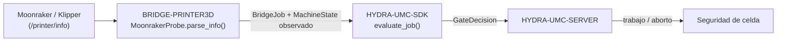

<!-- =============================================================================
HYDRA-UMC-BRIDGE-PRINTER3D - Puente de software para impresión 3D
Copyright (C) 2026 JuanenRac (Electro Hobby 3D) <electrohobby3d@gmail.com>
GPL-3.0-or-later - see LICENSE
============================================================================= -->

<p align="center">
  
</p>

# 🖨️ HYDRA-UMC-BRIDGE-PRINTER3D

<p align="center"><a href="README.md">🇺🇸 English</a> | 🇪🇸 <b>Español</b> | <a href="README_fra.md">🇫🇷 Français</a> | <a href="README_ita.md">🇮🇹 Italiano</a> | <a href="README_deu.md">🇩🇪 Deutsch</a> | <a href="README_zho.md">🇨🇳 简体中文</a> | <a href="README_jpn.md">🇯🇵 日本語</a></p>

### 🌡️ Puente de coordinación seguro por defecto para software abierto de impresión 3D

<p align="left">
  
  
  
</p>

---

## 1. 🛠️ VISIÓN TÉCNICA GENERAL

**HYDRA-UMC-BRIDGE-PRINTER3D** es el coordinador de alto nivel para software abierto de impresión 3D (Moonraker/Klipper) y auxiliares robóticos HYDRA-UMC. También reconoce artefactos locales de slicer en modo de solo lectura. El firmware nativo de la impresora sigue siendo responsable en todo momento del movimiento, los calefactores, la protección térmica y los enclavamientos de máquina; este puente solo lee la disponibilidad, registra evidencia del artefacto y coordina auxiliares a su alrededor.

Pertenece a la familia **External Automation Bridges**: un conjunto de repositorios hermanos (CNC, LASER, OPENPNP, PRINTER3D, ROS2) que hablan el mismo contrato de seguridad compartido de `HYDRA-UMC-SDK`, de modo que ningún puente puede inventar su propia definición de "seguro para trabajar".

### Características clave:
* ✅ **Sonda de disponibilidad Moonraker, real:** `moonraker.py` — `MoonrakerProbe` consume el endpoint documentado `/printer/info` de Moonraker con un pequeño cliente basado únicamente en la biblioteca estándar (`urlopen` + `json`), sin dependencias adicionales más allá de la biblioteca estándar de Python. *(implementado, probado en `tests/test_moonraker.py`)*
* ✅ **Análisis de estado seguro por defecto, real:** `parse_info()` solo mapea la cadena literal `"ready"` a `MachineState.IDLE`; `startup`/`shutdown`/`error` se mapean a `FAULT`, y cualquier otra cosa (incluida una respuesta malformada) se mapea a `OFFLINE` — nunca a un estado que permitiría planificar un robot alrededor de la impresora. *(implementado)*
* ✅ **Puerta de seguridad compartida, real:** cada trabajo observado se reevalúa mediante `evaluate_job()` de `bridge_contract` en `HYDRA-UMC-SDK`, la misma puerta que usan todos los puentes hermanos y HYDRA-UMC-SERVER. *(implementado)*
* ✅ **Inspección de artefactos independiente del slicer:** `artifacts.py` identifica G-code FDM simple de OrcaSlicer, Ultimaker Cura, PrusaSlicer, Bambu Studio y otros slicers solo mediante evidencia local; también reconoce paquetes 3MF y slices de resina compatibles con Lychee sin desempaquetar, analizar comandos, subir ni imprimir. *(implementado, probado en `tests/test_artifacts.py`)*
* ✅ **Frontera de evidencia de perfil:** `profiles.py` puede emparejar un artefacto inspeccionado con un perfil FDM o de resina declarado, pero devuelve `execution_authorized=False` incluso cuando hay coincidencia. *(implementado, probado en `tests/test_profiles.py`)*
* ✅ **Comandos de trabajo reales, controlados por el SDK:** `MoonrakerJobControl` envía peticiones `POST` reales a los endpoints documentados `/printer/print/start|pause|resume|cancel` de Moonraker — `start_job()` está condicionado a la misma decisión de `evaluate_job()` que usa todo despacho productivo de este ecosistema; `pause_job()`/`cancel_job()` siempre están permitidos (mismo razonamiento de desescalada que `ABORT`); `resume_job()` requiere que la impresora esté genuinamente en `HOLDING`. Solo inicia por nombre un archivo ya subido y ya laminado — nunca transmite G-code en bruto. *(implementado, probado en `tests/test_moonraker.py`)*
* ✅ **Compilación/prueba no mutante:** `build-test.bat`/`.sh` compilan el analizador de respuestas y la puerta de seguridad sin enviar G-code, cambiar versiones ni tocar una impresora. *(implementado, ver COMPILACIÓN Y EJECUCIÓN más abajo)*
* 🔜 **Transmisión de G-code en bruto** — deliberadamente aplazada aún: enviar comandos arbitrarios de bajo nivel (no un trabajo con nombre, ya laminado) necesita un perfil probado, autenticación y una revisión de seguridad física que este puente todavía no tiene. *(planeado)*

---

## 2. 🔄 FLUJO DE COORDINACIÓN DE IMPRESORA



---

## 3. 🧱 ARQUITECTURA Y DECISIONES DE DISEÑO

* **Por qué solo el estado literal `"ready"` de Moonraker se mapea a reposo.** El mapeo de estado de `parse_info()` es deliberadamente estrecho: `ready` → `IDLE`, `startup`/`shutdown`/`error` → `FAULT` (seguro por defecto), y cualquier otro valor o valor ausente → `OFFLINE`. No existe una suposición de "seguro por defecto" para un estado de impresora no reconocido.
* **Por qué el análisis es un `@staticmethod` separado de la obtención por red.** `MoonrakerProbe.parse_info()` recibe un `dict` sencillo y es totalmente comprobable mediante pruebas unitarias sin necesidad de una llamada de red ni una impresora en marcha; `fetch()` es la pieza delgada y necesariamente de red que lo llama. La lógica relevante para la seguridad reside en la parte que nunca necesita una impresora real para probarse.
* **Por qué la sonda usa `urlopen`/`json` de la biblioteca estándar en lugar de una librería cliente de Moonraker.** Mantener la superficie de dependencias limitada a la biblioteca estándar de Python mantiene el análisis relevante para la seguridad mínimo, auditable y libre de las propias suposiciones de un cliente de terceros sobre reintentos, tiempos de espera o manejo de errores.
* **Por qué el puente construye un nuevo `BridgeJob` y delega en el `evaluate_job()` compartido en lugar de escribir su propia lógica de aceptación/rechazo.** Los cinco External Automation Bridges (CNC, LASER, OPENPNP, PRINTER3D, ROS2) reutilizan exactamente el mismo `bridge_contract` de `HYDRA-UMC-SDK`, de modo que "qué cuenta como seguro para iniciar un trabajo" no puede divergir silenciosamente entre ellos.
* **Por qué los comandos de trabajo (start/pause/resume/cancel) son reales pero la transmisión de G-code en bruto todavía no lo es.** Los endpoints `/printer/print/*` de Moonraker solo referencian por nombre un archivo ya subido y ya laminado - el mismo margen de seguridad que Moonraker/Klipper ya aplican sobre ese archivo. El G-code arbitrario en bruto es una superficie de confianza fundamentalmente distinta y mucho mayor (puede contener cualquier cosa) y todavía necesita un perfil probado, autenticación y una revisión de seguridad física que este puente aún no tiene.
* **Por qué `resume_job()` no reutiliza la puerta genérica de `evaluate_job()`.** Esa puerta está construida en torno a "el trabajo productivo necesita una máquina IDLE" - lo contrario de reanudar un trabajo pausado, que solo tiene sentido desde `HOLDING`. Mismo razonamiento de puerta independiente ya usado para `stand_request()`/`sit_request()` de DROIDS.
* **Cómo encaja en el resto del ecosistema.** BRIDGE-PRINTER3D se sitúa entre Moonraker/Klipper y `HYDRA-UMC-SDK` → `HYDRA-UMC-SERVER` → seguridad de celda: coordina trabajo robótico auxiliar alrededor de la impresora, nunca reemplaza el firmware nativo, los calefactores ni la protección térmica.

## 🧾 COMPATIBILIDAD DE ARTEFACTOS DE SLICER

La vía de artefactos de solo lectura admite G-code FDM normal (`.gcode`, `.gco`, `.gc`) generado por OrcaSlicer, Ultimaker Cura, PrusaSlicer, Bambu Studio y otros slicers. Los comentarios habituales aportan una pista de origen; si falta una marca se conserva `unknown-slicer`. `.gcode.3mf` y `.3mf` genérico se identifican, pero nunca se desempaquetan. Los slices de resina (`.ctb`, `.goo`, `.photon`, `.pwmo`, `.pws`, `.sl1`) de flujos compatibles con Lychee se tratan deliberadamente como opacos y nunca se atribuyen a una impresora o slicer concreto.

Esta es compatibilidad con **artefactos de salida**, no control remoto de esas aplicaciones. El puente no inicia slicers, altera perfiles, analiza/ejecuta G-code, sube archivos, contacta servicios en la nube ni inicia impresiones. Consulta [Compatibilidad de artefactos de slicer](docs/SLICER_ARTIFACT_COMPATIBILITY.md) para la matriz precisa y los requisitos de control futuro.

---

## 📂 ESTRUCTURA DE DIRECTORIOS

```text
HYDRA-UMC-BRIDGE-PRINTER3D/
├── src/
│   └── hydra_umc_bridge_printer3d/
│       ├── __init__.py
│       ├── artifacts.py         # Evidencia solo lectura de G-code, 3MF y slices de resina
│       └── moonraker.py         # Puerta de seguridad MoonrakerProbe + PrinterBridge
├── tests/
│   ├── test_artifacts.py         # Pruebas de evidencia de slicer (sin E/S de impresora)
│   └── test_moonraker.py        # Pruebas de análisis de disponibilidad y puerta de seguridad
├── tools/
│   ├── build_test.py            # Compilador + ejecutor de pruebas no mutante (build-test.bat/.sh)
│   ├── inspect_print_artifact.py # CLI JSON de evidencia local del artefacto
│   └── bump_version.py          # Sincroniza pyproject.toml, manifiesto y CHANGELOG.md
├── build-test.bat / build-test.sh  # Solo valida, nunca modifica el repositorio
├── build.bat / build.sh            # Valida y, solo si tiene éxito, sube versión + CHANGELOG
├── pyproject.toml               # Metadatos del paquete; depende de HYDRA-UMC-SDK (git)
├── hydra-umc.project.json       # Manifiesto del ecosistema (versión, madurez, familia)
├── CHANGELOG.md
├── CODE_OF_CONDUCT.md / CONTRIBUTING.md / SECURITY.md / SUPPORT.md
├── LICENSE / LICENSE.md
└── README.md / README_*.md      # Este archivo y sus 6 traducciones
```

---

## 4. ⚙️ COMPILACIÓN Y EJECUCIÓN

Requiere Python 3.11+. `tools/build_test.py` espera que `HYDRA-UMC-SDK` esté clonado como directorio hermano (`../HYDRA-UMC-SDK`) o indicado mediante la variable de entorno `HYDRA_UMC_SDK_ROOT`.

```bash
# Windows
build-test.bat      # solo valida — sin cambio de versión/CHANGELOG
build.bat            # valida y, si tiene éxito, sube versión + CHANGELOG

# Linux/macOS
bash build-test.sh
bash build.sh
```

`build-test` compila cada módulo de `src/` y `tools/` con `py_compile` y ejecuta la batería completa de `unittest` (`tests/test_moonraker.py` y `tests/test_artifacts.py`), demostrando el análisis de disponibilidad, la inspección de artefactos y la puerta de seguridad — no envía G-code, no toca una impresora y nunca modifica el repositorio. `build` ejecuta primero esa misma validación y, solo si tiene éxito, llama a `tools/bump_version.py` para sincronizar la versión en `pyproject.toml`, `hydra-umc.project.json` y `CHANGELOG.md`. Todavía no existe un comando `run` real de impresora — eso requiere un perfil probado, autenticación y revisión de seguridad física.

Para inspeccionar una salida de slicer local sin contactar una impresora:

```bash
py tools/inspect_print_artifact.py ruta/al/trabajo.gcode
```

---

## ✅ ESTADO ACTUAL Y PRÓXIMOS PASOS

**Real hoy:** versión `0.0.7`, un adaptador de disponibilidad Moonraker probado en local (`MoonrakerProbe` + `PrinterBridge`) apoyado en la puerta de trabajo compartida de `HYDRA-UMC-SDK`, evidencia de artefactos G-code/3MF/slices de resina y de compatibilidad de perfil en solo lectura, una batería `unittest` determinista de diecisiete pruebas que incluye la verificación del contrato HTTP local `/printer/info`, y scripts de build-test no mutantes conectados a CI con clonado del SDK.

**Frontera de integración:** el firmware nativo de la impresora (Klipper vía Moonraker) conserva en todo momento el movimiento, los calefactores, la protección térmica y los enclavamientos de máquina; este puente solo lee disponibilidad y controla trabajo robótico *auxiliar* a su alrededor.

**Todavía pendiente:** el puente no ha controlado una impresora, un hotend ni un robot reales — enviar comandos reales requiere antes un perfil de impresora probado, autenticación y una revisión de seguridad física.

---

## 🔗 PROYECTOS RELACIONADOS

Este proyecto forma parte de un ecosistema robótico más amplio del mismo autor (JuanenRac / Electro Hobby 3D), que abarca firmware, software de control, nodos de IA y herramientas de flota. Merece la pena conocerlo, ya que una petición podría en realidad referirse a uno de estos proyectos y no a este repositorio.

### Directamente relacionados

- **[HYDRA-UMC-SDK](https://github.com/JuanenRac/HYDRA-UMC-SDK)** — la puerta de trabajo compartida `bridge_contract` a través de la cual este puente (y todos los demás) evalúa sus trabajos.
- **[HYDRA-UMC-SERVER](https://github.com/JuanenRac/HYDRA-UMC-SERVER)** — el punto de coordinación autorizado al que reporta este puente.
- **[HYDRA-UMC-MQTT-BROKER](https://github.com/JuanenRac/HYDRA-UMC-MQTT-BROKER)** — el transporte real de `mqtt_transport.py` para los propios topics `hydra/bridges/printer3d/...` de este puente (estado, start/pause/resume/cancel real de Moonraker, la puerta de trabajo compartida) - consulta el propio `docs/BRIDGE_TOPICS.md` de ese repositorio.
- **[HYDRA-UMC-SAFETY-ZONES](https://github.com/JuanenRac/HYDRA-UMC-SAFETY-ZONES)** — futura evidencia de seguridad del espacio de trabajo.

### Resto del ecosistema

**Plataforma HYDRA-UMC** — la micro-fábrica multi-robot para la que este puente coordina auxiliares
- **[HYDRA-UMC](https://github.com/JuanenRac/HYDRA-UMC)** — la placa base CM5 + STM32H745 que orquesta hasta 8 brazos robóticos.
- **[HYDRA-UMC-SERVER](https://github.com/JuanenRac/HYDRA-UMC-SERVER)** — el backend Express/WebSocket con el que hablan todos los clientes de control y puentes.
- **[HYDRA-UMC-STUDIO](https://github.com/JuanenRac/HYDRA-UMC-STUDIO)** — panel de control web, visualización 3D multi-robot.

**External Automation Bridges** — repositorios hermanos que comparten esta misma puerta de trabajo de `HYDRA-UMC-SDK`
- **[HYDRA-UMC-BRIDGE-CNC](https://github.com/JuanenRac/HYDRA-UMC-BRIDGE-CNC)** — puente de coordinación de celda CNC.
- **[HYDRA-UMC-BRIDGE-LASER](https://github.com/JuanenRac/HYDRA-UMC-BRIDGE-LASER)** — puente de coordinación de celdas láser.
- **[HYDRA-UMC-BRIDGE-OPENPNP](https://github.com/JuanenRac/HYDRA-UMC-BRIDGE-OPENPNP)** — puente de flujo de placas para OpenPnP.
- **[HYDRA-UMC-BRIDGE-ROS2](https://github.com/JuanenRac/HYDRA-UMC-BRIDGE-ROS2)** — frontera de coordinación bidireccional con ROS 2.

**Evidencia de seguridad e integración**
- **[HYDRA-UMC-SAFETY-ZONES](https://github.com/JuanenRac/HYDRA-UMC-SAFETY-ZONES)** — evidencia de seguridad de zonas de celda usada en toda la familia de puentes.
- **[HYDRA-UMC-HIL-BRIDGE](https://github.com/JuanenRac/HYDRA-UMC-HIL-BRIDGE)** — evidencia de pruebas hardware-in-the-loop.

## 👤 AUTOR
**JuanenRac** (Electro Hobby 3D)
📧 electrohobby3d@gmail.com
📺 [youtube.com/@electrohobby3d](https://youtube.com/@electrohobby3d)

## 📜 LICENCIA
GPL-3.0 - Ver LICENSE para más detalles.
