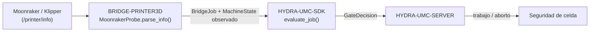

<!-- =============================================================================
HYDRA-UMC-BRIDGE-PRINTER3D - Puente de software para impresión 3D
Copyright (C) 2026 JuanenRac (Electro Hobby 3D) <electrohobby3d@gmail.com>
GPL-3.0-or-later - see LICENSE
============================================================================= -->

<p align="center">
  
</p>

# 🖨️ HYDRA-UMC-BRIDGE-PRINTER3D

<p align="center"><a href="README.md">🇺🇸 English</a> | 🇪🇸 <b>Español</b> | <a href="README_fra.md">🇫🇷 Français</a> | <a href="README_ita.md">🇮🇹 Italiano</a> | <a href="README_deu.md">🇩🇪 Deutsch</a> | <a href="README_zho.md">🇨🇳 简体中文</a> | <a href="README_jpn.md">🇯🇵 日本語</a></p>

### 🌡️ Puente de coordinación seguro por defecto para software abierto de impresión 3D

<p align="left">
  
  
  
</p>

---

## 1. 🛠️ VISIÓN TÉCNICA GENERAL

**HYDRA-UMC-BRIDGE-PRINTER3D** es el coordinador de alto nivel para software abierto de impresión 3D (Moonraker/Klipper) y auxiliares robóticos HYDRA-UMC. También reconoce artefactos locales de slicer en modo de solo lectura. El firmware nativo de la impresora sigue siendo responsable en todo momento del movimiento, los calefactores, la protección térmica y los enclavamientos de máquina; este puente solo lee la disponibilidad, registra evidencia del artefacto y coordina auxiliares a su alrededor.

Pertenece a la familia **External Automation Bridges**: un conjunto de repositorios hermanos (CNC, LASER, OPENPNP, PRINTER3D, ROS2) que hablan el mismo contrato de seguridad compartido de `HYDRA-UMC-SDK`, de modo que ningún puente puede inventar su propia definición de "seguro para trabajar".

### Características clave:
* ✅ **Sonda de disponibilidad Moonraker, real:** `moonraker.py` — `MoonrakerProbe` consume el endpoint documentado `/printer/info` de Moonraker con un pequeño cliente basado únicamente en la biblioteca estándar (`urlopen` + `json`), sin dependencias adicionales más allá de la biblioteca estándar de Python. *(implementado, probado en `tests/test_moonraker.py`)*
* ✅ **Análisis de estado seguro por defecto, real:** `parse_info()` solo mapea la cadena literal `"ready"` a `MachineState.IDLE`; `startup`/`shutdown`/`error` se mapean a `FAULT`, y cualquier otra cosa (incluida una respuesta malformada) se mapea a `OFFLINE` — nunca a un estado que permitiría planificar un robot alrededor de la impresora. *(implementado)*
* ✅ **Puerta de seguridad compartida, real:** cada trabajo observado se reevalúa mediante `evaluate_job()` de `bridge_contract` en `HYDRA-UMC-SDK`, la misma puerta que usan todos los puentes hermanos y HYDRA-UMC-SERVER. *(implementado)*
* ✅ **Inspección de artefactos independiente del slicer:** `artifacts.py` identifica G-code FDM simple de OrcaSlicer, Ultimaker Cura, PrusaSlicer, Bambu Studio y otros slicers solo mediante evidencia local; también reconoce paquetes 3MF y slices de resina compatibles con Lychee sin desempaquetar, analizar comandos, subir ni imprimir. *(implementado, probado en `tests/test_artifacts.py`)*
* ✅ **Frontera de evidencia de perfil:** `profiles.py` puede emparejar un artefacto inspeccionado con un perfil FDM o de resina declarado, pero devuelve `execution_authorized=False` incluso cuando hay coincidencia. *(implementado, probado en `tests/test_profiles.py`)*
* ✅ **Comandos de trabajo reales, controlados por el SDK:** `MoonrakerJobControl` envía peticiones `POST` reales a los endpoints documentados `/printer/print/start|pause|resume|cancel` de Moonraker — `start_job()` está condicionado a la misma decisión de `evaluate_job()` que usa todo despacho productivo de este ecosistema; `pause_job()`/`cancel_job()` siempre están permitidos (mismo razonamiento de desescalada que `ABORT`); `resume_job()` requiere que la impresora esté genuinamente en `HOLDING`. Solo inicia por nombre un archivo ya subido y ya laminado — nunca transmite G-code en bruto. *(implementado, probado en `tests/test_moonraker.py`)*
* ✅ **Compilación/prueba no mutante:** `build-test.bat`/`.sh` compilan el analizador de respuestas y la puerta de seguridad sin enviar G-code, cambiar versiones ni tocar una impresora. *(implementado, ver COMPILACIÓN Y EJECUCIÓN más abajo)*
* 🔜 **Transmisión de G-code en bruto** — deliberadamente aplazada aún: enviar comandos arbitrarios de bajo nivel (no un trabajo con nombre, ya laminado) necesita un perfil probado, autenticación y una revisión de seguridad física que este puente todavía no tiene. *(planeado)*

---

## 2. 🔄 FLUJO DE COORDINACIÓN DE IMPRESORA



---

## 3. 🧱 ARQUITECTURA Y DECISIONES DE DISEÑO

* **Por qué solo el estado literal `"ready"` de Moonraker se mapea a reposo.** El mapeo de estado de `parse_info()` es deliberadamente estrecho: `ready` → `IDLE`, `startup`/`shutdown`/`error` → `FAULT` (seguro por defecto), y cualquier otro valor o valor ausente → `OFFLINE`. No existe una suposición de "seguro por defecto" para un estado de impresora no reconocido.
* **Por qué el análisis es un `@staticmethod` separado de la obtención por red.** `MoonrakerProbe.parse_info()` recibe un `dict` sencillo y es totalmente comprobable mediante pruebas unitarias sin necesidad de una llamada de red ni una impresora en marcha; `fetch()` es la pieza delgada y necesariamente de red que lo llama. La lógica relevante para la seguridad reside en la parte que nunca necesita una impresora real para probarse.
* **Por qué la sonda usa `urlopen`/`json` de la biblioteca estándar en lugar de una librería cliente de Moonraker.** Mantener la superficie de dependencias limitada a la biblioteca estándar de Python mantiene el análisis relevante para la seguridad mínimo, auditable y libre de las propias suposiciones de un cliente de terceros sobre reintentos, tiempos de espera o manejo de errores.
* **Por qué el puente construye un nuevo `BridgeJob` y delega en el `evaluate_job()` compartido en lugar de escribir su propia lógica de aceptación/rechazo.** Los cinco External Automation Bridges (CNC, LASER, OPENPNP, PRINTER3D, ROS2) reutilizan exactamente el mismo `bridge_contract` de `HYDRA-UMC-SDK`, de modo que "qué cuenta como seguro para iniciar un trabajo" no puede divergir silenciosamente entre ellos.
* **Por qué los comandos de trabajo (start/pause/resume/cancel) son reales pero la transmisión de G-code en bruto todavía no lo es.** Los endpoints `/printer/print/*` de Moonraker solo referencian por nombre un archivo ya subido y ya laminado - el mismo margen de seguridad que Moonraker/Klipper ya aplican sobre ese archivo. El G-code arbitrario en bruto es una superficie de confianza fundamentalmente distinta y mucho mayor (puede contener cualquier cosa) y todavía necesita un perfil probado, autenticación y una revisión de seguridad física que este puente aún no tiene.
* **Por qué `resume_job()` no reutiliza la puerta genérica de `evaluate_job()`.** Esa puerta está construida en torno a "el trabajo productivo necesita una máquina IDLE" - lo contrario de reanudar un trabajo pausado, que solo tiene sentido desde `HOLDING`. Mismo razonamiento de puerta independiente ya usado para `stand_request()`/`sit_request()` de DROIDS.
* **Cómo encaja en el resto del ecosistema.** BRIDGE-PRINTER3D se sitúa entre Moonraker/Klipper y `HYDRA-UMC-SDK` → `HYDRA-UMC-SERVER` → seguridad de celda: coordina trabajo robótico auxiliar alrededor de la impresora, nunca reemplaza el firmware nativo, los calefactores ni la protección térmica.

## 🧾 COMPATIBILIDAD DE ARTEFACTOS DE SLICER

La vía de artefactos de solo lectura admite G-code FDM normal (`.gcode`, `.gco`, `.gc`) generado por OrcaSlicer, Ultimaker Cura, PrusaSlicer, Bambu Studio y otros slicers. Los comentarios habituales aportan una pista de origen; si falta una marca se conserva `unknown-slicer`. `.gcode.3mf` y `.3mf` genérico se identifican, pero nunca se desempaquetan. Los slices de resina (`.ctb`, `.goo`, `.photon`, `.pwmo`, `.pws`, `.sl1`) de flujos compatibles con Lychee se tratan deliberadamente como opacos y nunca se atribuyen a una impresora o slicer concreto.

Esta es compatibilidad con **artefactos de salida**, no control remoto de esas aplicaciones. El puente no inicia slicers, altera perfiles, analiza/ejecuta G-code, sube archivos, contacta servicios en la nube ni inicia impresiones. Consulta [Compatibilidad de artefactos de slicer](docs/SLICER_ARTIFACT_COMPATIBILITY.md) para la matriz precisa y los requisitos de control futuro.

---

## 📂 ESTRUCTURA DE DIRECTORIOS

```text
HYDRA-UMC-BRIDGE-PRINTER3D/
├── src/
│   └── hydra_umc_bridge_printer3d/
│       ├── __init__.py
│       ├── artifacts.py         # Evidencia solo lectura de G-code, 3MF y slices de resina
│       ├── profiles.py          # Evidencia de compatibilidad de perfiles; nunca autorización de impresión
│       ├── moonraker.py         # Puerta de seguridad MoonrakerProbe + PrinterBridge
│       └── mqtt_transport.py    # Transporte MQTT real para la lógica ya real de Moonraker de este bridge
├── tests/
│   ├── test_artifacts.py         # Pruebas de evidencia de slicer (sin E/S de impresora)
│   ├── test_profiles.py         # El emparejamiento de perfiles siempre deniega la ejecución
│   ├── test_moonraker.py        # Pruebas de análisis de disponibilidad y puerta de seguridad
│   └── test_mqtt_transport.py   # Tests de forma de comando/estado MQTT contra un cliente de broker simulado
├── tools/
│   ├── build_test.py            # Compilador + ejecutor de pruebas no mutante (build-test.bat/.sh)
│   ├── inspect_print_artifact.py # CLI JSON de evidencia local del artefacto
│   ├── assess_print_profile.py  # CLI de comparación perfil-artefacto sin conexión; nunca autoriza ejecución
│   ├── ci_validate.py           # Línea base de CI sin dependencias y no destructiva (usada por .github/workflows/ci.yml)
│   └── bump_version.py          # Sincroniza pyproject.toml, manifiesto y CHANGELOG.md
├── docs/
│   ├── BRIDGE_GUIDE.md                        # Alcance, plataformas compatibles, scripts, puerta de aceptación de hardware
│   ├── PRINT_PROFILE_BOUNDARY.md              # Qué significa la evidencia de compatibilidad de perfiles frente a la autorización de impresión
│   └── SLICER_ARTIFACT_COMPATIBILITY.md       # Qué formatos de artefacto de slicer puede leer este bridge como evidencia
├── images/
│   └── HYDRA_UMC_BANNER.svg     # Banner del README
├── build-test.bat / build-test.sh  # Solo valida, nunca modifica el repositorio
├── build.bat / build.sh            # Valida y, solo si tiene éxito, sube versión + CHANGELOG
├── pyproject.toml               # Metadatos del paquete; depende de HYDRA-UMC-SDK (git)
├── hydra-umc.project.json       # Manifiesto del ecosistema (versión, madurez, familia)
├── CHANGELOG.md
├── CODE_OF_CONDUCT.md / CONTRIBUTING.md / SECURITY.md / SUPPORT.md
├── LICENSE / LICENSE.md
└── README.md / README_*.md      # Este archivo y sus 6 traducciones
```

---

## 4. ⚙️ COMPILACIÓN Y EJECUCIÓN

Requiere Python 3.11+. `tools/build_test.py` espera que `HYDRA-UMC-SDK` esté clonado como directorio hermano (`../HYDRA-UMC-SDK`) o indicado mediante la variable de entorno `HYDRA_UMC_SDK_ROOT`.

```bash
# Windows
build-test.bat      # solo valida — sin cambio de versión/CHANGELOG
build.bat            # valida y, si tiene éxito, sube versión + CHANGELOG

# Linux/macOS
bash build-test.sh
bash build.sh
```

`build-test` compila cada módulo de `src/` y `tools/` con `py_compile` y ejecuta la batería completa de `unittest` (`tests/test_moonraker.py` y `tests/test_artifacts.py`), demostrando el análisis de disponibilidad, la inspección de artefactos y la puerta de seguridad — no envía G-code, no toca una impresora y nunca modifica el repositorio. `build` ejecuta primero esa misma validación y, solo si tiene éxito, llama a `tools/bump_version.py` para sincronizar la versión en `pyproject.toml`, `hydra-umc.project.json` y `CHANGELOG.md`. Todavía no existe un comando `run` real de impresora — eso requiere un perfil probado, autenticación y revisión de seguridad física.

Para inspeccionar una salida de slicer local sin contactar una impresora:

```bash
py tools/inspect_print_artifact.py ruta/al/trabajo.gcode
```

---

## ✅ ESTADO ACTUAL Y PRÓXIMOS PASOS

**Real hoy:** versión `0.1.0`, un adaptador de disponibilidad Moonraker probado en local (`MoonrakerProbe` + `PrinterBridge`) apoyado en la puerta de trabajo compartida de `HYDRA-UMC-SDK`, comandos de trabajo reales controlados por el SDK (`MoonrakerJobControl`: iniciar/pausar/reanudar/cancelar un archivo ya subido a través de la propia API REST de Moonraker), evidencia de artefactos G-code/3MF/slices de resina y de compatibilidad de perfil en solo lectura para las principales familias de laminadores, una batería `unittest` determinista de cuarenta y nueve pruebas que incluye la verificación del contrato HTTP local `/printer/info`, el contrato real y separado `/printer/objects/query?print_stats=state`, y la verificación real de comandos de trabajo `POST`, y scripts de build-test no mutantes conectados a CI con clonado del SDK.

**Frontera de integración:** el firmware nativo de la impresora (Klipper vía Moonraker) conserva en todo momento el movimiento, los calefactores, la protección térmica y los enclavamientos de máquina; este puente solo lee disponibilidad y controla trabajo robótico *auxiliar* a su alrededor.

**Todavía pendiente:** el puente no ha controlado una impresora, un hotend ni un robot reales — enviar comandos reales requiere antes un perfil de impresora probado, autenticación y una revisión de seguridad física.

---

## 🔗 Proyectos Relacionados

Este proyecto es parte del ecosistema de robótica HYDRA-UMC del mismo autor (JuanenRac / Electro Hobby 3D). Vale la pena conocerlo, ya que una petición podría en realidad ser sobre alguno de estos en vez de sobre este repositorio.

**Proyecto Padre**
- **[HYDRA-UMC-SERVER](https://github.com/JuanenRac/HYDRA-UMC-SERVER)** — el backend headless real (REST/WebSocket) con el que habla de verdad cada cliente de control; la frontera autenticada del ecosistema a la que reporta este bridge una vez cada comando ha superado la barrera de seguridad local de este propio bridge.

**Proyectos Hermanos** — también hablan con la propia API de HYDRA-UMC-SERVER, cada uno como su propio cliente
- **[HYDRA-UMC-STUDIO](https://github.com/JuanenRac/HYDRA-UMC-STUDIO)** — panel de control web con visualización 3D multi-robot en tiempo real.
- **[HYDRA-UMC-SUITE](https://github.com/JuanenRac/HYDRA-UMC-SUITE)** — centro de mando de enjambre de escritorio (PySide6) para varios servidores a la vez, empaquetado como ejecutable independiente.
- **[HYDRA-UMC-ANDROID-CONTROL](https://github.com/JuanenRac/HYDRA-UMC-ANDROID-CONTROL)** — app nativa de control para Android con inicio de sesión biométrico y un compañero Wear OS emparejado.
- **[HYDRA-UMC-IOS-CONTROL](https://github.com/JuanenRac/HYDRA-UMC-IOS-CONTROL)** — app de control para iOS/iPadOS (Flutter) con sincronización en tiempo real por WebSocket.
- **[HYDRA-UMC-DSI](https://github.com/JuanenRac/HYDRA-UMC-DSI)** — interfaz táctil nativa para la pantalla táctil DSI de 7" a bordo, embebida en el propio CM5.
- **[HYDRA-UMC-BRIDGE-AMR](https://github.com/JuanenRac/HYDRA-UMC-BRIDGE-AMR)** — barrera de coordinación para flotas AGV/AMR mediante un publicador MQTT VDA 5050 real.
- **[HYDRA-UMC-BRIDGE-CNC](https://github.com/JuanenRac/HYDRA-UMC-BRIDGE-CNC)** — coordinador de alto nivel para celdas CNC con acceso real a estado/bytes de control GRBL.
- **[HYDRA-UMC-BRIDGE-DROIDS](https://github.com/JuanenRac/HYDRA-UMC-BRIDGE-DROIDS)** — barrera de coordinación para droides con patas/humanoides, con un emisor de comandos real para Boston Dynamics Spot.
- **[HYDRA-UMC-BRIDGE-LASER](https://github.com/JuanenRac/HYDRA-UMC-BRIDGE-LASER)** — coordinador de seguridad para celdas láser que lee 3 salvaguardas GPIO reales de llave/carcasa/enclavamiento.
- **[HYDRA-UMC-BRIDGE-OPENPNP](https://github.com/JuanenRac/HYDRA-UMC-BRIDGE-OPENPNP)** — coordinador de alto nivel seguro para el flujo de placas de pick-and-place OpenPnP.
- **[HYDRA-UMC-BRIDGE-ROS2](https://github.com/JuanenRac/HYDRA-UMC-BRIDGE-ROS2)** — coordinador de seguridad con un transporte ROS 2 rclpy real, importado de forma perezosa.
- **[HYDRA-UMC-BRIDGE-UAV](https://github.com/JuanenRac/HYDRA-UMC-BRIDGE-UAV)** — barrera de coordinación para UAV equipados con cámara, con un emisor de comandos MAVLink real.

**Directamente Relacionados**
- **[HYDRA-UMC-SDK](https://github.com/JuanenRac/HYDRA-UMC-SDK)** — el contrato JSON-Schema compartido y la barrera de seguridad contra la que cada bridge valida sus comandos.
- **[HYDRA-UMC-MQTT-BROKER](https://github.com/JuanenRac/HYDRA-UMC-MQTT-BROKER)** — el transporte real de `mqtt_transport.py` para los propios tópicos `hydra/bridges/printer3d/...` de este bridge — estado más los comandos reales de Moonraker start/pause/resume/cancel, junto con la barrera de trabajos compartida; ver el propio `docs/BRIDGE_TOPICS.md` de ese repositorio.
- **[HYDRA-UMC-SAFETY-ZONES](https://github.com/JuanenRac/HYDRA-UMC-SAFETY-ZONES)** — futura evidencia de seguridad del espacio de trabajo para este bridge.

**También Forma Parte del Ecosistema**

*Hardware y Plataforma Base*
- **[HYDRA-UMC](https://github.com/JuanenRac/HYDRA-UMC)** — la placa madre física del brazo robótico: host CM5 + coprocesador STM32H745 de doble núcleo, coordinando hasta 8 brazos herramienta por CAN-OTA/SPI-OTA.
- **[HYDRA-UMC-OS](https://github.com/JuanenRac/HYDRA-UMC-OS)** — capa de producto reproducible sobre Raspberry Pi OS para el CM5: agente de solo lectura, config/perfiles validados, aprovisionamiento WiFi de primer contacto.

*Backend Central y Clientes*
- **[HYDRA-UMC-EDITOR-URDF](https://github.com/JuanenRac/HYDRA-UMC-EDITOR-URDF)** — creador/editor gráfico de URDF de escritorio que envía los modelos terminados al propio catálogo de STUDIO.

*Plataforma de Herramientas URTC*
- **[URTC](https://github.com/JuanenRac/URTC)** — firmware para la placa física del Universal Robot Tool Controller, más de 25 perfiles de herramienta por bus CAN.
- **[URTC-FLASHER](https://github.com/JuanenRac/URTC-FLASHER)** — herramienta de escritorio con GUI para flashear placas URTC, CAN-OTA más SWD/JTAG de chip completo.
- **[URTC-TESTER](https://github.com/JuanenRac/URTC-TESTER)** — herramienta de escritorio de diagnóstico CAN-bus en vivo para placas URTC, un panel por perfil de herramienta.
- **[URTC-WEB-STUDIO](https://github.com/JuanenRac/URTC-WEB-STUDIO)** — alternativa basada en navegador a URTC-TESTER mediante la Web Serial API, sin instalación local.

*Nodo IA de Visión (Hailo-8)*
- **[HYDRA-UMC-VISION-NODE](https://github.com/JuanenRac/HYDRA-UMC-VISION-NODE)** — nodo de integración para el pipeline de visión Hailo-8, con una comprobación real de disponibilidad de hardware por etapa.
- **[HYDRA-UMC-DETECTION-HEF](https://github.com/JuanenRac/HYDRA-UMC-DETECTION-HEF)** — registro real de modelos compilados con verificación de carga segura por arquitectura Hailo/checksum.
- **[HYDRA-UMC-VISION-STREAMER](https://github.com/JuanenRac/HYDRA-UMC-VISION-STREAMER)** — generador real de pipeline GStreamer + config MediaMTX, con una frontera de integración HailoRT real.
- **[HYDRA-UMC-VISUAL-SERVOING-API](https://github.com/JuanenRac/HYDRA-UMC-VISUAL-SERVOING-API)** — ley de corrección real de Position-Based Visual Servoing, con puerta de seguridad según el estado de zona previo.

*Nodo IA Cognitivo (Hailo-10)*
- **[HYDRA-UMC-COGNITIVE-NODE](https://github.com/JuanenRac/HYDRA-UMC-COGNITIVE-NODE)** — nodo de integración para el pipeline cognitivo Hailo-10 (orquestación de LLM/VLA/voz).
- **[HYDRA-UMC-VLA-ENGINE](https://github.com/JuanenRac/HYDRA-UMC-VLA-ENGINE)** — codificación/decodificación real de tokens de acción y generación de trayectoria para un modelo Vision-Language-Action.
- **[HYDRA-UMC-VOICE-UI](https://github.com/JuanenRac/HYDRA-UMC-VOICE-UI)** — front-end de voz real (VAD + analizador de intención) con un relé a Watch acotado y con confirmación.
- **[HYDRA-UMC-SEMANTIC-PLANNER](https://github.com/JuanenRac/HYDRA-UMC-SEMANTIC-PLANNER)** — descomposición real de tareas basada en reglas y recuperación semántica de errores sobre códigos de error del MCU.
- **[HYDRA-UMC-DOCS-QA](https://github.com/JuanenRac/HYDRA-UMC-DOCS-QA)** — búsqueda real de documentos TF-IDF (solo librería estándar) sobre los propios documentos Markdown de este ecosistema.

*Orquestación y Enjambre*
- **[HYDRA-UMC-ORCHESTRATOR](https://github.com/JuanenRac/HYDRA-UMC-ORCHESTRATOR)** — nodo de integración con un contrato real de informe de salud gRPC/Protobuf y una máquina de estados de misión.
- **[HYDRA-UMC-JOB-DISPATCHER](https://github.com/JuanenRac/HYDRA-UMC-JOB-DISPATCHER)** — cola de trabajos real basada en prioridad con deduplicación, sobre una API HTTP real.
- **[HYDRA-UMC-NODE-HEALING](https://github.com/JuanenRac/HYDRA-UMC-NODE-HEALING)** — watchdog de salud de flota real basado en gRPC, con reintento/backoff y detección de discrepancia de identidad.
- **[HYDRA-UMC-PATH-PLANNER-3D](https://github.com/JuanenRac/HYDRA-UMC-PATH-PLANNER-3D)** — planificador de rutas 3D real basado en RRT, con validación real de colisión de obstáculos/espacio de trabajo.
- **[HYDRA-UMC-SWARM-SYNC](https://github.com/JuanenRac/HYDRA-UMC-SWARM-SYNC)** — sincronización de estado real mediante CRDT LWW-Element-Map, con pruebas de propiedades para convergencia multi-celda.

*Gemelo Digital y Simulación*
- **[HYDRA-UMC-TWIN](https://github.com/JuanenRac/HYDRA-UMC-TWIN)** — nodo de integración para el motor de gemelo digital, con un contrato real de sincronización por compatibilidad de versión.
- **[HYDRA-UMC-HIL-BRIDGE](https://github.com/JuanenRac/HYDRA-UMC-HIL-BRIDGE)** — enclavamiento de seguridad real hardware-in-the-loop que enruta comandos entre simulación y hardware real.
- **[HYDRA-UMC-PHYSICS-REPLICA](https://github.com/JuanenRac/HYDRA-UMC-PHYSICS-REPLICA)** — cinemática directa real y validación de límites articulares sobre un subconjunto real de URDF.
- **[HYDRA-UMC-SYNTHETIC-DATA-GEN](https://github.com/JuanenRac/HYDRA-UMC-SYNTHETIC-DATA-GEN)** — generador real de escenas 2D procedurales con exportación de anotaciones YOLO/COCO.

*Datos y Analítica*
- **[HYDRA-UMC-DATALAKE](https://github.com/JuanenRac/HYDRA-UMC-DATALAKE)** — almacén de series temporales real respaldado por sqlite3, con una API HTTP real de ingesta/consulta.
- **[HYDRA-UMC-ANOMALY-DETECTOR](https://github.com/JuanenRac/HYDRA-UMC-ANOMALY-DETECTOR)** — detector de anomalías real basado en FFT + línea base estadística, con monitorización de deriva.
- **[HYDRA-UMC-PRODUCTION-REPORTS](https://github.com/JuanenRac/HYDRA-UMC-PRODUCTION-REPORTS)** — cálculo real de OEE/disponibilidad sobre el histórico de DATALAKE, con exportación CSV reproducible.
- **[HYDRA-UMC-TELEMETRY-COLLECTOR](https://github.com/JuanenRac/HYDRA-UMC-TELEMETRY-COLLECTOR)** — pipeline real de ingesta CAN/WebSocket hacia DATALAKE, con deduplicación por secuencia.

*Pasarela Industrial*
- **[HYDRA-UMC-GATEWAY-INDUSTRIAL](https://github.com/JuanenRac/HYDRA-UMC-GATEWAY-INDUSTRIAL)** — nodo de integración que retransmite a protocolos industriales, con una capa real de lista blanca de comandos/contrapresión.
- **[HYDRA-UMC-OPCUA-SERVER](https://github.com/JuanenRac/HYDRA-UMC-OPCUA-SERVER)** — espacio de direcciones OPC-UA real, verificado con una sesión de cliente real del protocolo binario.
- **[HYDRA-UMC-MTCONNECT-ADAPTER](https://github.com/JuanenRac/HYDRA-UMC-MTCONNECT-ADAPTER)** — endpoints XML reales `/probe` y `/current` de MTConnect, con salida en modo degradado.

*Herramientas Complementarias y Operaciones del Ecosistema*
- **[HYDRA-UMC-DASHBOARD-AI](https://github.com/JuanenRac/HYDRA-UMC-DASHBOARD-AI)** — paneles de Resúmenes Inteligentes y Resaltado de Anomalías sobre DATALAKE/ANOMALY-DETECTOR, con un respaldo estadístico honesto.
- **[HYDRA-UMC-TOOL-CLI](https://github.com/JuanenRac/HYDRA-UMC-TOOL-CLI)** — CLI de flota con un contrato real y estable de códigos de salida, cliente real y en vivo de la propia API de HYDRA-UMC-SERVER.
- **[HYDRA-UMC-WATCH](https://github.com/JuanenRac/HYDRA-UMC-WATCH)** — app compañera de WearOS con alertas hápticas reales y un relé de voz al teléfono emparejado.
- **[URTC-SMART-RACK](https://github.com/JuanenRac/URTC-SMART-RACK)** — firmware para un rack de montaje de placas con decodificación real de ID de herramienta y lógica de precalentamiento Smart Idle.
- **[URTC-VISION-TOOL](https://github.com/JuanenRac/URTC-VISION-TOOL)** — firmware más un compañero de visión real en Python para un cabezal de inspección térmica/RGB.
- **[HYDRA-UMC-UPDATER](https://github.com/JuanenRac/HYDRA-UMC-UPDATER)** — herramienta administrativa de escritorio que descubre, clona y actualiza cada repositorio de este ecosistema.

## 👤 AUTOR
**JuanenRac** (Electro Hobby 3D)
📧 electrohobby3d@gmail.com
📺 [youtube.com/@electrohobby3d](https://youtube.com/@electrohobby3d)

## 📜 LICENCIA
GPL-3.0 - Ver LICENSE para más detalles.
