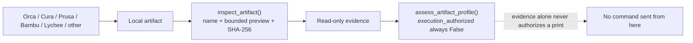

<!-- =============================================================================
HYDRA-UMC-BRIDGE-PRINTER3D - Slicer artifact compatibility boundary
Copyright (C) JuanenRac (Electro Hobby 3D) <electrohobby3d@gmail.com>
GPL-3.0-or-later - see LICENSE
============================================================================= -->

# Slicer Artifact Compatibility

## Purpose

This document covers only artifact inspection (`inspect_artifact()`, `assess_artifact_profile()` - see [PRINT_PROFILE_BOUNDARY.md](PRINT_PROFILE_BOUNDARY.md)). That module accepts local slicer output as **read-only evidence**: it does not launch a slicer, alter a project, unpack a package, parse or execute G-code, or open any network connection at all - it never contacts Moonraker or a printer.

Printer command dispatch is a genuinely separate, already-implemented module (`MoonrakerJobControl` in `moonraker.py`, reached over MQTT via `mqtt_transport.py`'s `cmd/start`/`cmd/pause`/`cmd/resume`/`cmd/cancel`). It really does send start/pause/resume/cancel to Moonraker's own REST API, gated by this ecosystem's shared `evaluate_job()` decision plus this bridge's own phase/cell/printer-state checks - see that module's own docstring for the exact boundary. It is not future work, and it does not currently consult the artifact evidence described here at all: a `cmd/start` request's `filename` is accepted on its own terms, independent of whatever `assess_artifact_profile()` would say about it.

This boundary lets the ecosystem record the identity and origin hint of a proposed print while native printer firmware retains motion, heaters, thermal protection and all machine interlocks.

## Current compatible artifact lane

| Slicer / family | Input accepted today | Result | Explicitly not done |
|---|---|---|---|
| OrcaSlicer | Plain `.gcode`, `.gco` or `.gc` | SHA-256 evidence and an `OrcaSlicer` hint when its normal comment marker is present | Starting OrcaSlicer, changing profiles, sending the G-code |
| Ultimaker Cura | Plain `.gcode`, `.gco` or `.gc` | SHA-256 evidence and an `Ultimaker Cura` hint when its normal comment marker is present | Launching Cura or modifying its project/settings |
| PrusaSlicer | Plain `.gcode`, `.gco` or `.gc` | SHA-256 evidence and a `PrusaSlicer` hint when its normal comment marker is present | Running post-processing or a printer upload |
| Bambu Studio | Plain `.gcode`, `.gco` or `.gc` | SHA-256 evidence and a `Bambu Studio` hint when its normal comment marker is present | Logging in, cloud/LAN control or printer upload |
| Any other FDM slicer | Plain `.gcode`, `.gco` or `.gc` | Generic FDM evidence; absent or unfamiliar comments remain `unknown-slicer` | Treating the artifact as safe to print |
| OrcaSlicer/Bambu and compatible packages | `.gcode.3mf` | Identified and fingerprinted as an FDM package only | ZIP/3MF extraction, project interpretation or command execution |
| Any 3MF slicer project | `.3mf` | Identified and fingerprinted as a project/package; technology remains unknown | Assuming it is a printable job |
| Lychee Slicer and compatible resin workflows | `.ctb`, `.goo`, `.photon`, `.pwmo`, `.pws`, `.sl1` | Identified and fingerprinted as an opaque resin-slice artifact | Claiming a particular slicer/printer, decoding it, transferring it or starting resin hardware |

An extension and a comment marker are evidence, not a trust decision. A known G-code comment never authorizes physical motion or a print start.

## Safe flow (artifact inspection only)

`tools/inspect_print_artifact.py <file>` prints only this evidence as JSON and exits non-zero for an unavailable or unknown artifact. It never opens a network connection. This diagram deliberately stops at "no command sent from here" - it says nothing about `MoonrakerJobControl` (see Purpose above), which is a separate module reached over MQTT, not from this evidence.

## Scope: implemented vs. genuinely still open

Three separate things get conflated too easily; naming the current state of each precisely:

- **Read-only artifact inspection** (this document): fully implemented today, as described above.
- **Real printer command dispatch** (`MoonrakerJobControl`, see Purpose above): also already implemented and unit-tested against this repo's own HTTP fixture - start/pause/resume/cancel genuinely reach Moonraker's REST API when its gate allows them. This is a live capability, not future work.
- **Genuinely unimplemented today**: the artifact/profile evidence above is never consulted by that command dispatch - a mismatched or unidentified artifact does not (yet) block a `cmd/start` requested independently over MQTT. Also unimplemented: printer-model-specific nozzle/material/volume limits, and a reviewed command allow-list wider than the fixed four above (start/pause/resume/cancel).
- **Genuinely unvalidated today**: every test of the command-dispatch path runs against this repo's own HTTP fixture, never a real Moonraker/Klipper instance or physical printer. A real hardware test remains required before relying on it operationally.

This repository makes no promise of operational compatibility with every slicer or every printer model - only with the specific artifact kinds and comment markers listed in the table above, and only with a Moonraker/Klipper-driven printer for the command-dispatch module.
