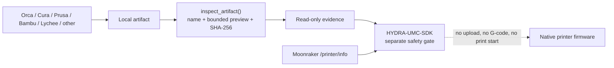

<!-- =============================================================================
HYDRA-UMC-BRIDGE-PRINTER3D - Slicer artifact compatibility boundary
Copyright (C) 2026 JuanenRac (Electro Hobby 3D) <electrohobby3d@gmail.com>
GPL-3.0-or-later - see LICENSE
============================================================================= -->

# Slicer Artifact Compatibility

## Purpose

HYDRA-UMC-BRIDGE-PRINTER3D accepts local slicer output as **read-only evidence**. It does not launch a slicer, alter a project, unpack a package, parse or execute G-code, upload a job, or contact a printer. Moonraker remains a separate read-only readiness channel.

This boundary lets the ecosystem record the identity and origin hint of a proposed print while native printer firmware retains motion, heaters, thermal protection and all machine interlocks.

## Current compatible artifact lane

| Slicer / family | Input accepted today | Result | Explicitly not done |
|---|---|---|---|
| OrcaSlicer | Plain `.gcode`, `.gco` or `.gc` | SHA-256 evidence and an `OrcaSlicer` hint when its normal comment marker is present | Starting OrcaSlicer, changing profiles, sending the G-code |
| Ultimaker Cura | Plain `.gcode`, `.gco` or `.gc` | SHA-256 evidence and an `Ultimaker Cura` hint when its normal comment marker is present | Launching Cura or modifying its project/settings |
| PrusaSlicer | Plain `.gcode`, `.gco` or `.gc` | SHA-256 evidence and a `PrusaSlicer` hint when its normal comment marker is present | Running post-processing or a printer upload |
| Bambu Studio | Plain `.gcode`, `.gco` or `.gc` | SHA-256 evidence and a `Bambu Studio` hint when its normal comment marker is present | Logging in, cloud/LAN control or printer upload |
| Any other FDM slicer | Plain `.gcode`, `.gco` or `.gc` | Generic FDM evidence; absent or unfamiliar comments remain `unknown-slicer` | Treating the artifact as safe to print |
| OrcaSlicer/Bambu and compatible packages | `.gcode.3mf` | Identified and fingerprinted as an FDM package only | ZIP/3MF extraction, project interpretation or command execution |
| Any 3MF slicer project | `.3mf` | Identified and fingerprinted as a project/package; technology remains unknown | Assuming it is a printable job |
| Lychee Slicer and compatible resin workflows | `.ctb`, `.goo`, `.photon`, `.pwmo`, `.pws`, `.sl1` | Identified and fingerprinted as an opaque resin-slice artifact | Claiming a particular slicer/printer, decoding it, transferring it or starting resin hardware |

An extension and a comment marker are evidence, not a trust decision. A known G-code comment never authorizes physical motion or a print start.

## Safe flow

`tools/inspect_print_artifact.py <file>` prints only this evidence as JSON and exits non-zero for an unavailable or unknown artifact. It never opens a network connection.

## Future admission work

Before any future upload or printer-control capability, the bridge requires all of the following: a target-printer-specific profile, authenticated native-controller integration, an artifact-to-profile compatibility check, a reviewed allow-list of commands, physical safety validation, and a real hardware test. That future work is deliberately separate from this read-only compatibility layer.
